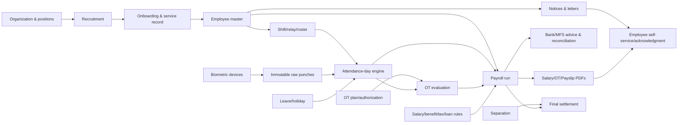
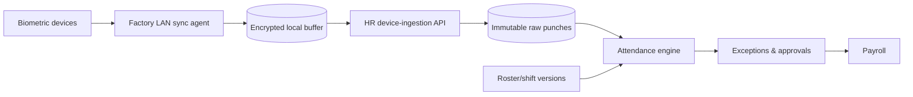

# Bangladesh HR, Payroll, Attendance & Document Automation

**Product context:** Companion module for the DyeFlow dyeing, drying and finishing ERP/MES  
**Target:** Bangladesh dyehouses and textile wet-processing factories, including standalone, composite-group and EPZ configurations  
**Document status:** System-design and implementation baseline  
**Research date:** 7 September 2026  

---

## 1. Design conclusion

The HR module should be a **full employee-lifecycle, time, payroll and controlled-document system**, not only an attendance import and salary calculator.

A Bangladesh-compatible implementation must support:

- General factories and EPZ establishments as separate regulatory profiles
- Effective-dated labour law, rule, minimum-wage, income-tax and company-policy versions
- Approved organogram, worker classifications, grades and employment types
- Recruitment, appointment, ID/service records, confirmation and transfers
- Multiple factories, departments, sections, floors and cost centers using tenant-configured 12-hour Day/Night pairs and weekly Crew A/B rotation
- Biometric devices with offline LAN synchronization and immutable raw punches
- Attendance correction, leave and overtime workflows with separation of duties
- Salary structures, allowances, attendance-linked pay, OT, bonuses, arrears, loans/advances, authorized deductions, tax, benefits and final settlement
- Form-aligned statutory registers and bilingual A4/PDF outputs
- General notices and employee-specific letters with approval, delivery and acknowledgment
- Bank/mobile-financial-service payment files and reconciliation
- Employee self-service in Bangla and English
- Privacy, auditability and repeatable payroll calculations

There is no single screen layout or wage formula that makes software compatible with every Bangladeshi dyehouse. Compatibility is achieved by configuration packages, exact source-document mapping, rule versioning and factory acceptance tests.

---

## 2. Legal and market research baseline

This is a software design, not legal advice. HR/legal teams must validate configuration before payroll go-live.

### 2.1 General factories

The consolidated [Bangladesh Labour Act 2006](https://bdlaws.minlaw.gov.bd/act-print-952.html) includes employment/service records, work hours, overtime, leave, wages, deductions and termination matters. The law has been amended, including the [Bangladesh Labour (Amendment) Act 2026](https://dife.gov.bd/pages/laws/%E0%A6%AC%E0%A6%BE%E0%A6%82%E0%A6%B2%E0%A6%BE%E0%A6%A6%E0%A7%87%E0%A6%B6-%E0%A6%B6%E0%A7%8D%E0%A6%B0%E0%A6%AE-%E0%A6%B8%E0%A6%82%E0%A6%B6%E0%A7%8B%E0%A6%A7%E0%A6%A8-%E0%A6%86%E0%A6%87%E0%A6%A8-%E0%A7%A8%E0%A7%A6%E0%A7%A8%E0%A7%AC-yy84ye-6a097f157aa29b4dab974311). The system must therefore cite and store the consolidated provision/rule version used rather than naming only the original 2006 Act.

The Department of Inspection for Factories and Establishments lists the [Bangladesh Labour Rules 2015 and 2022 amendment](https://dife.portal.gov.bd/pages/static-pages/6922dc42933eb65569e0f517). The rules and DIFE material establish locally recognizable records and documents, including:

- Worker ID and appointment/service-book issuance register (Forms 6/6A)
- Service book (Form 7) and worker register (Form 8)
- Leave register/book (Form 9)
- Daily attendance and overtime register (Form 34)
- Working-hours notices (Forms 37/37A/37B as applicable)
- Wage register and wage slip (Form 38)
- Damage-deduction and advance registers (Forms 39 and 40)

DIFE's current service pages also identify approval of working-hours notices through its digital services and reference Form 38 wage information in factory licensing material. [DIFE digital services](https://dife.gov.bd/pages/static-pages/6922de9c933eb65569e1bf97) and [DIFE citizen charter](https://dife.gov.bd/pages/office-citizen-charters/6922d8ad933eb65569df9b78).

### 2.2 Overtime baseline

The consolidated Act states the ordinary daily/weekly working-hour framework and premium overtime principle. The Labour Rules describe an hourly calculation basis and require the overtime record in Form 34. Because amendments, exemptions, wage definitions, worker categories and EPZ rules may affect a particular establishment, the formula must be configured and approved, not embedded as an unchangeable `basic/208 × 2` expression.

The default general-factory ruleset can represent the Rules' monthly-worker calculation as:

```text
ordinary_hourly_basis = configured_ot_wage_basis / configured_monthly_hours_divisor
ot_hourly_rate        = ordinary_hourly_basis × configured_premium_multiplier
payable_ot            = approved_payable_minutes / 60 × ot_hourly_rate
```

For a profile derived from the 2015 Rules, the HR/legal administrator may configure the relevant wage components, divisor and premium stated by the applicable rule. Every payslip must store the resolved inputs, formula version, intermediate values, rounding steps and final amount.

### 2.3 EPZ establishments

An EPZ factory must not silently reuse the general-factory profile. BEPZA publishes the applicable EPZ labour acts/rules and wage notifications, including the EPZ Labour Act, EPZ Labour Rules 2022 and minimum-wage structure. [BEPZA acts and policies](https://www.bepza.gov.bd/public/acts-policies).

Each `LegalEstablishment` therefore selects one regulatory regime:

- `BD_GENERAL_FACTORY`
- `BD_EPZ`
- a future approved regime/version

Transfers between legal establishments close/transfer the applicable employment record through an authorized workflow; they do not merely change a department field.

### 2.4 Minimum wage and tax

Minimum wages in Bangladesh are sector/grade/effective-date dependent. The Minimum Wage Board publishes sector notices and latest declarations. Do not assume that a dyehouse automatically uses an RMG sewing-sector grade or an EPZ rate. [Minimum Wage Board](https://mwb.portal.gov.bd/) and [latest declarations](https://mwb.portal.gov.bd/site/page/8c809e54-b25a-46cc-a87b-9df264468e5b/Rates-of-Minimum-Wages-%28Latest-Declaration%29).

Income-tax rates and withholding rules also change by tax year. NBR publishes the current income-tax circulars and Finance Acts, including 2026 materials. [NBR income-tax circulars](https://nbr.gov.bd/taxtypes/income-tax/income-tax-paripatra/eng), [Finance Acts](https://nbr.gov.bd/regulations/acts/finance-acts), and [income-tax rules](https://nbr.gov.bd/regulations/rules/income-tax-rules/eng).

The payroll system stores tax-year profiles and never overwrites a finalized prior year's calculation when a new slab/rule is loaded.

### 2.5 Product-market evidence

Bangladesh HR/payroll products commonly connect biometric attendance, shifts, OT, leave, payroll, advances/tax, payslips and salary/bank sheets. This supports the proposed product shape but is vendor marketing, not proof of legal compliance. Examples include [SORS ERP HR/payroll](https://erp.sorstechnology.com/features/hr-payroll-software/), [CSL Kormee](https://cslsoft.com.bd/wp-content/uploads/2024/07/Kormee-6-Brochure.pdf), and the local dyeing ERP module set described by [Infocrat](https://infocrat.com.bd/textile-dyeing-erp-software/).

Odoo and Frappe HR provide reusable international foundations. Odoo connects employee contracts, working schedules, attendance, time off and payroll but explicitly says payroll fields vary by localization; this means Bangladesh localization must be verified. [Odoo Payroll](https://www.odoo.com/documentation/19.0/applications/hr/payroll.html) and [Odoo Employees](https://www.odoo.com/documentation/19.0/applications/hr/employees.html). Frappe HR supports effective payroll periods, formula-based salary components, salary structures and salary slips. [Frappe HR Payroll Setup](https://docs.frappe.io/hr/payroll-setup) and [Shift Management](https://docs.frappe.io/hr/shift-management).

---

## 3. Bangladesh factory compatibility framework

### 3.1 Supported factory profiles

The same codebase should support these profiles through configuration:

| Dimension | Options |
|---|---|
| Legal regime | General Bangladesh factory; EPZ; additional approved profile |
| Business type | Commission dyehouse; own-material dyehouse; mixed; group/shared service |
| Organization | Single factory; multiple factories; multiple legal entities |
| Workforce | Monthly worker; daily/temporary where lawful; salaried staff; contractor-supplied worker records |
| Operation | Two continuous 12-hour shifts: Day and Night; two crews rotate between them |
| Attendance | Biometric; RFID/card; supervised manual; imported file; mobile only where approved |
| Payment | Bank; mobile financial service; cheque/cash only where approved and lawful |
| Language | Bangla; English; bilingual document/profile |
| Payroll period | Monthly default; other lawful periods where needed |
| Deployment | Cloud + LAN edge; on-premises; multi-site hybrid |

### 3.2 Tenant-owned HR configuration

Every subscribing company/group is a **tenant**. Shift, roster, attendance and OT rules are tenant-owned records, not global constants. A tenant can operate one or many legal establishments and sites without seeing or changing another tenant's data.

Configuration precedence is:

```text
Platform safety defaults
→ tenant policy
→ legal establishment/site policy
→ department/shift policy
→ approved employee assignment exception
```

A lower level may specialize a rule only where permitted. It cannot weaken a statutory minimum, bypass a legal cap or change a closed payroll silently. All operational rows carry `tenant_id`; foreign keys, unique indexes, caches, queues, exports, object storage and audit searches must enforce the same tenant boundary.

Tenant setup includes:

- Time zone, week start, language, payroll cut-off, calendars and default legal/regulatory profile
- Independent two-shift time pair, weekly rotation day, two crews and roster publication horizon
- Independent attendance grace, pairing, rounding and exception policies
- Independent OT operating mode, authorization chain, rate formula, caps, rounding and payroll mapping
- Feature flags for roster generation, biometric adapters, employee self-service and production-demand integration
- Tenant-specific Bangla/English document templates, approval matrix, numbering and notification channels
- Effective date, draft/test/published status and configuration-change audit for every rule version

The UI must always show the active tenant and legal establishment. A group administrator may switch among explicitly authorized tenants, but a shift template or OT rule is copied into another tenant as a new owned version; it is never a shared mutable record.

### 3.3 Familiar Bangladesh UI layout

Use a consistent left navigation and dense but readable list/detail layout. Operators should not navigate an international HR vocabulary tree.

Recommended main navigation:

```text
HR Dashboard
├── Organization & Organogram
├── Recruitment
├── Employee / Worker Information
├── Appointment, ID & Service Book
├── Shift / Relay / Roster
├── Attendance & Corrections
├── Leave & Holidays
├── Overtime
├── Payroll & Salary
├── Bonus, Arrear & Increment
├── Loan / Advance / PF / Gratuity
├── Notices & Letters
├── Training, Skills, PPE & Medical
├── Grievance & Discipline
├── Separation & Final Settlement
├── Employee Self-Service
├── Compliance Registers & Reports
└── Setup & Rule Versions
```

Layout rules:

- Bangla/English labels are selected by user, while employee names/addresses can store both scripts.
- Worker-facing documents are A4 and print-correct; ID cards use a separately configured card format.
- High-volume pages use column chooser, saved filter, department/section/shift facets, sticky totals and bulk actions with approval.
- Dashboard colors are supplementary; every state also has text/icon.
- Factory terminals have large touch targets and minimal fields; HR/admin pages may use dense grids.
- Employee header always shows worker ID, card/token, photo, legal establishment, department/section, designation/grade, status and current shift.
- Sensitive salary, NID, bank, medical and disciplinary data are masked by role.
- Every report carries factory name/address/registration identifiers, period, generation time, filter scope, page number and authorized signature blocks.

### 3.4 Terminology dictionary

Labels are configurable without changing database semantics. Default aliases include:

| Canonical concept | Common display labels |
|---|---|
| Employee | Employee / Worker / শ্রমিক-কর্মচারী |
| Employee number | Employee ID / Worker ID / Card No. / Token No. |
| Organization unit | Department / Section / Floor / Unit |
| Work schedule | Shift / Relay / Roster / Duty Schedule |
| Attendance correction | Miss-punch correction / হাজিরা সংশোধন |
| Overtime | OT / অধিকাল |
| Payroll result | Salary Sheet / Wage Sheet / বেতন বিবরণী |
| Individual payroll | Payslip / Wage Slip / বেতন স্লিপ |
| Notice | Notice / Circular / নোটিশ / বিজ্ঞপ্তি |
| Letter | Appointment / Warning / Transfer / Increment / Release letter |

Database/API names remain stable so changing a label does not break integration.

### 3.5 Document-profile engine

Each factory can configure:

- Header/logo/legal name/address/registration numbers
- Bangla, English or side-by-side bilingual content
- Number pattern by document and legal establishment
- A4 portrait/landscape, ID-card and envelope formats
- Required fields, columns and signature blocks
- Digital signature/image signature policy
- Revenue-stamp/signature/thumb-impression placeholders where HR/legal requires them
- QR verification URL or document hash
- Copy marks: Employee, HR, Accounts, Security, Notice Board
- Effective template version and approval authority
- Retention, confidentiality watermark and distribution channels

Do not claim a report is a statutory form merely because its heading says “Form 38.” HR/legal must approve the mapped fields against the currently applicable official form/version.

---

## 4. Module map



---

## 5. Organization, organogram and workforce planning

### Functions

- Legal entity and legal establishment master
- Factory, building, floor, department, section, work center, cost center and reporting line
- Effective-dated approved organogram version
- Position ID separate from employee; one position can be vacant/frozen/filled
- Headcount budget by department, grade, shift and employment class
- Job description, risk category, required skill/certification and medical/PPE requirements
- Worker classifications and employment status configured from applicable law/service rules
- Minimum-wage sector/grade mapping per position and establishment
- Supervisor, attendance approver, OT approver, leave approver and payroll cost center
- Manpower requirement linked optionally to the dyehouse production schedule

### Controls

- Hiring beyond approved headcount needs an exception approval.
- Moving a position between grade/regime creates a new effective version.
- An employee cannot be active in two full-time positions in the same period unless explicitly supported and lawful.
- Organogram reports show approved, filled, vacant, temporary and excess positions.

---

## 6. Recruitment and onboarding

### Recruitment

- Manpower requisition with justification, position, headcount, shift, replacement/new, target date and budget
- Approval workflow by department, HR, finance and management
- Vacancy publication source, applicant and referral tracking
- Candidate identity/contact/education/experience/skills and consent
- Interview/test/medical/reference/background stages as configured
- Offer approval, offer letter and expiry
- Duplicate candidate/employee identity warning with controlled handling
- Recruitment source, lead time, cost and conversion reporting

### Onboarding

- Worker/employee number and card/token allocation
- Photo, legal name in Bangla/English, parent/spouse details where applicable, date of birth, present/permanent address, phone, emergency contact, blood group, education, skill and identification marks
- NID/birth registration/passport/work authorization as applicable, with encrypted/masked identifiers
- Position, department/section, designation, grade, class, employment type, joining date, probation and contract
- Salary structure and wage/minimum-grade validation
- Bank/MFS account with ownership/verification status
- Nominee/dependent/beneficiary records with effective dates
- Appointment letter, employee ID card, service book/record and issuance acknowledgment
- Orientation, policy acknowledgment, safety/chemical training, PPE issue and required medical/fitness steps
- Biometric enrollment and device-to-employee mapping
- Onboarding checklist and overdue escalation

### Privacy

Do not expose family, identity, bank, medical or disciplinary data to production managers unless required for a defined duty. Store document images in encrypted object storage with access logging.

---

## 7. Employee and service record

The employee profile is the source for identity; the employment contract/service record is effective-dated history.

Maintain:

- Personal and emergency information
- Appointment/ID/service-book issuance
- Legal establishment and regulatory profile
- Position/designation/grade/department/section/shift
- Worker class/status and effective employment periods
- Wage/salary and allowance revision history
- Transfers, promotions, confirmations, probation extensions and increments
- Leave history and balances
- Training, certification, skill matrix and competence authorization
- PPE/equipment/assets issued
- Medical/fitness restrictions visible only to authorized health/HR roles
- Conduct/disciplinary record with strict access and retention policy
- Nomination/beneficiary and dependents
- Contract documents and acknowledgments
- Separation/rejoin history without reusing prior employment IDs incorrectly

Important rule: correct a factual identity error through a controlled amendment. Do not overwrite service, wage, grade or department history that affected payroll or a signed document.

---

## 8. Shift, relay and roster management

### 8.1 Researched Bangladesh dyehouse operating model

This product uses one shift model for dyeing, drying, finishing, lab, utility, ETP and maintenance coverage: **two continuous 12-hour shifts and two rotating crews**. It does not expose 8-hour/three-shift, flexible, split or open-shift types in normal tenant setup.

The reason for rotation is fundamental: **the factory runs continuously; an individual worker does not**. Machines, batches, boilers, utilities and ETP may require 24/7 coverage, but workers require sleep, recovery and personal/family time. Crew A and Crew B therefore hand work to each other instead of one person continuing into the next shift. Weekly swapping also shares the more desirable Day duty and the burden of Night duty across both crews.

Core scheduling invariants:

- No employee may be assigned both sides of the same Day/Night handover.
- A normal employee assignment is one 12-hour roster block, never a 24-hour Day-plus-Night block.
- The next crew must take responsibility through a recorded shift handover even when a dyeing batch is still running.
- Rest between assignments is calculated and validated per employee, not assumed from crew membership.
- Day hours, Night hours, holiday H1/H2 hours and OT are measured by employee and crew to prove fair distribution.
- A supervisor replacement never creates overlapping duty for the replaced or replacement worker.
- Any exceptional extension retains an explicit reason, approval, actual punches and compliance result.

Research supporting this correction:

- A UNIDO study of Bangladesh textile/clothing operations records 24-hour dyeing/printing/textile production and a two-shift example of 06:00–18:00 and 18:00–06:00. [UNIDO Bangladesh textile study, pp. 59–60](https://downloads.unido.org/ot/49/90/4990284/15001-20000_18909.pdf)
- A Biswas Synthetic industrial-attachment report describes two 12-hour production shifts: 08:00–20:00 and 20:00–08:00, alongside dyeing/finishing shift responsibilities. [Biswas Group industrial attachment](https://www.slideshare.net/slideshow/industrial-attachment-of-biswas-group-ltd/42486009)
- An Apex composite-factory report records 12-hour shifts changing at 08:30/20:30 and swapping after one week on Saturday; it describes four hours as daily OT in that observed practice. [Apex industrial attachment](https://www.slideshare.net/slideshow/i-ndustrial-attachment-of-apex-spinning-and-kniting-mills-ltd/34536617)
- A current Bangladesh dyeing shift-officer listing still requires rotational shift work and shift-to-shift production records/handover. [Clifton Group dyeing shift role](https://bd.linkedin.com/jobs/view/shift-officer-dyeing-clifton-group-job-id-1514262-at-bdjobs-com-4443270289)

These sources establish an industry workflow pattern, not legal permission for every hour arrangement. The official Labour Act generally distinguishes ordinary work, breaks, overtime, weekly limits, spread-over and night-relay treatment. The ERP must preserve the 12-hour **coverage roster** while separately calculating actual work, breaks, regular time and legally payable OT under the establishment's current approved profile. [Bangladesh Labour Act, sections 100–111](https://bdlaws.minlaw.gov.bd/act-print-952.html)

### 8.2 Tenant-owned two-shift pair

Each tenant configures exactly one effective-dated shift pair per site/covered operation:

| Required shift | Default example | Rule |
|---|---|---|
| Day / Shift A | 08:00–20:00 | Tenant selects the day start; duration is 12 hours |
| Night / Shift B | 20:00–08:00 next day | Begins when Day ends; duration is 12 hours; `end_day_offset = 1` |

Other valid tenant examples include 06:00–18:00/18:00–06:00 and 08:30–20:30/20:30–08:30. The setup form asks for the Day start time and calculates both shift boundaries. Advanced editing may change both boundaries, but validation requires:

- exactly two active production shifts;
- each shift spans 720 elapsed minutes;
- Night starts exactly when Day ends and Day starts exactly when Night ends;
- the pair covers 24 hours without a gap or overlap;
- Day and Night have explicit attendance windows, handover window and cross-midnight duty-date rule;
- breaks, regular paid minutes and planned OT minutes are stored separately from the 720-minute presence span;
- the pair references effective attendance, OT, weekly-holiday, night-work and allowance policies;
- any establishment-specific permission/working-hours notice is recorded with issuer, dates and attachment.

The same code `A` or `B` can have different start times in different tenants. All versions remain tenant-isolated and historical rosters keep the original version.

### 8.3 Two-crew weekly rotation

Employees are assigned to **Crew A** or **Crew B** by department/section/work center and effective date. The standard rotation alternates every seven days:

| Rotation week | Crew A | Crew B |
|---|---|---|
| Week 1 | Day / Shift A | Night / Shift B |
| Week 2 | Night / Shift B | Day / Shift A |
| Week 3 | Day / Shift A | Night / Shift B |

Each tenant chooses:

- rotation anchor date;
- change weekday, with Saturday supported as the Bangladesh factory default;
- change boundary, normally the Day-shift start;
- departments/work centers included in the rotation;
- how weekly holidays and approved leave replacements are handled;
- how many future weeks to generate and notify.

For rotation week number `w = floor((duty_date - anchor_date) / 7)`, Crew A receives Day when `w` is even and Night when `w` is odd; Crew B receives the opposite. The anchor determines which crew starts on Day. This is the only automatic rotation pattern in this scoped product.

Over every complete two-week cycle, each crew receives one Day week and one Night week. The ERP dashboard must compare scheduled and actual Day/Night hours per worker, flag permanent or disproportionate Night assignment, and show approved reasons for any imbalance.

When the rotation boundary is also a staffed weekly off-day/holiday, the normal swap is expanded into the two 18-hour H1/H2 bridge defined in section 10; the crews still emerge in the same swapped Day/Night positions.

### 8.4 Roster, replacement and publication controls

```text
Setup two-shift pair
→ create Crew A and Crew B
→ assign workers with effective dates
→ choose Saturday/other tenant rotation day and anchor date
→ generate weekly Day/Night roster
→ validate attendance/OT/rest/leave exceptions
→ approve and publish
→ notify crews and print duty roster
```

- Preview Day/Night headcount and skills for dyeing, drying, finishing, lab, QC, chemical store, utility, ETP and maintenance.
- Leave, transfer or absence creates a replacement request; it never invents a third shift.
- An approved one-day crew/shift exchange retains the original roster, substitute, reason and approver.
- Production may request a replacement or OT plan but HR publishes the employee roster.
- Re-generation is idempotent and preserves published/frozen days plus approved replacements.
- Retroactive changes require an attendance/payroll impact report; a closed payroll uses correction/arrear workflow.
- The night duty date is the date on which the 20:00/18:00/20:30 shift began; post-midnight punches remain with that duty date.
- Publish an immutable roster version and generate Bangla/English department, employee and notice-board PDFs.

Minimum service operations are `configureTwoShiftPair`, `publishShiftPairVersion`, `assignCrewMember`, `generateWeeklyRotation`, `previewRoster`, `publishRoster`, `requestReplacement`, `approveReplacement` and `correctPublishedRoster`.

### 8.5 Twelve-hour attendance and payroll split

Do not equate the 12-hour roster span with 12 payable working hours in one field. For every employee-duty date, calculate and retain:

```text
roster span minutes (normally 720)
− recorded/approved break minutes
= actual work minutes

actual work minutes
→ regular minutes
→ candidate OT minutes
→ authorized/actual/payable OT comparison
→ non-payable absence or compliance exception, with reason
```

The observed factory convention of “8 regular hours + 4 OT hours” may be configured only as a planning/payroll proposal; biometric evidence, breaks, the current legal profile, authorization and any establishment-specific approval determine the payable result. The engine must warn or block a roster/pay result that violates the configured current daily, spread-over, weekly or annual/averaging control. It must never hide excess hours to make a report look compliant.

### 8.6 Dyehouse linkage

The production plan can forecast operators, colorists, QC, chemical store and maintenance coverage by skill, but individual salary and sensitive HR records never appear in production dashboards. Shop-floor authorization checks only employee status, shift and required skills/certifications.

---

## 9. Biometric and attendance engine

### 9.1 Device integration

- ZKTeco/Hikvision/other device adapters through factory LAN edge agent
- Push API when supported; scheduled pull/file import fallback
- Device inventory, serial, site, time zone, clock drift, health and last sync
- Employee-to-device ID mapping with collision detection
- Raw punch fields: device, device user ID, event time, received time, direction if supplied, verification mode, sequence/log ID and raw payload hash
- Raw punches are immutable; corrections create business attendance adjustments, never delete device evidence
- Store-and-forward during internet outage
- Idempotency prevents duplicate punch import
- Device time drift alerts and controlled bulk re-evaluation after correction

### 9.2 Attendance-day calculation

Inputs:

- Published shift/roster version
- Raw punches and approved manual punches
- Approved leave, holiday, movement/on-duty and training records
- Applicable attendance rule version

Outputs:

- In/out pairs and breaks
- Scheduled, actual and paid minutes
- Present, absent, weekly holiday, festival holiday, leave, late, early-out, miss-punch, on-duty, training and suspension/other configured states
- Candidate pre/post-shift OT minutes
- Allowance eligibility
- Exception list and explanation trace

Algorithm requirements:

- Correctly group overnight-shift punches with the intended duty day.
- Handle multiple in/out pairs and cross-midnight breaks.
- Do not guess an absent punch into existence silently.
- Flag impossible overlap, double in/out, remote-site mismatch and suspicious manual patterns.
- Preserve the original computed result and subsequent approved revisions.
- Provide a plain-language explanation, for example: “Roster B: 22:00–06:00; first in 21:52; last out 08:05; unpaid break 30m; candidate OT 120m; payable OT pending authorization.”

### 9.3 Correction workflow

`Employee/supervisor request → supporting reason/evidence → supervisor review → HR/attendance approval → recalculation → payroll-impact report`

After payroll finalization, a correction normally becomes an arrear/adjustment in the next open run. Reopening a finalized payroll requires a high-level controlled reversal.

---

## 10. Leave, holiday and absence

### 10.1 Tenant weekly off-day and holiday calendar

Each tenant/site publishes an effective-dated calendar with:

- Weekly off-day, normally Friday but selectable by tenant/site
- Festival holiday, government/special closure and company holiday as distinct types
- Paid/unpaid status, affected legal establishment/site/department and source notice
- `production_closed` or `continuous_dyehouse_coverage` operating mode
- Alternative/compensatory-holiday and premium-pay rule references
- Bangla/English employee notice, publication time and acknowledgment/audience snapshot

Do not treat a weekly off-day and a festival holiday as the same payroll event. The current Labour Act provides a weekly holiday in section 103, compensatory weekly holiday rules in section 104 and separate festival-holiday treatment in section 118. The exact current rule/profile and any exemption or establishment approval must determine leave and pay. [Bangladesh Labour Act](https://bdlaws.minlaw.gov.bd/act-print-952.html) DIFE also explains that factory workers receive a weekly holiday and, where applicable, a compensatory holiday for work on it. [DIFE labour-law FAQ](https://dife.khulna.gov.bd/pages/static-pages/69813c7c35ce18e1c06fda42)

### 10.2 Continuous-production holiday bridge

For a selected weekly off-day or approved holiday, the tenant can enable the factory's special **two-block holiday bridge**. With Friday as holiday and the normal pair at 08:00/20:00, the generated roster is:

| Block | Assigned crew | Start → end | Duration | Operational OT classification |
|---|---|---|---:|---|
| Thursday Day | Outgoing Day crew | Thu 08:00 → Thu 20:00 | 12h | Normal Day roster treatment |
| H1: pre-holiday Night extension | Outgoing Night crew | Thu 20:00 → Fri 14:00 | 18h | First 12h follows normal Night treatment; extra 6h is candidate OT |
| H2: holiday coverage | Outgoing Day crew | Fri 14:00 → Sat 08:00 | 18h | Entire 18h is holiday-duty candidate OT under tenant policy |
| Saturday Day | Former Night crew | Sat 08:00 → Sat 20:00 | 12h | Normal Day roster after weekly swap |
| Saturday Night | Former Day crew | Sat 20:00 → Sun 08:00 | 12h | Normal Night roster after weekly swap |

Timeline:

```text
Thu 08:00          Thu 20:00             Fri 14:00              Sat 08:00          Sat 20:00
|-- old Day: 12h --|-- old Night: H1 18h --|-- old Day: H2 18h --|-- new Day: 12h --|-- new Night
                    normal span + 6h OT       full holiday-duty OT
```

The bridge therefore replaces the three normal 12-hour blocks from Thursday 20:00 through Saturday 08:00 with two 18-hour assignments while keeping dyeing, drying, finishing and utilities running continuously.

H1 is one duty dated Thursday: its first 720 roster minutes follow the normal Night-shift treatment and its final 360 minutes carry `HOLIDAY_BRIDGE_EXTENSION` as the operational OT reason. H2 is one duty dated Friday: all 1,080 minutes carry `HOLIDAY_FULL_OT`, including the portion after midnight on Saturday. Actual breaks and punches can reduce worked/payable minutes, and the statutory rule engine may create separate pay/compensatory-leave components, but it must preserve the tenant's original H1/H2 classification and trace.

Let `H@S` mean the holiday date at the tenant's normal Day start:

```text
H1 start = H@S − 12 hours
H1 end   = H@S + 6 hours
H2 start = H@S + 6 hours
H2 end   = H@S + 24 hours
```

For `S = 08:00`, those become previous-day 20:00 → holiday 14:00 and holiday 14:00 → next-day 08:00. The rule is stored as a versioned `HolidayCoveragePolicy`; generated dates are immutable `HolidayBridgeOccurrence` records.

### 10.3 Rotation and OT fairness

The holiday bridge is part of the weekly crew swap, not a separate third crew:

- The outgoing Night crew receives H1 and its six additional operational OT hours.
- The outgoing Day crew receives H2 and its full holiday-duty OT block.
- After H2, the crews have swapped: old Night becomes the new Day crew; old Day becomes the new Night crew.
- On the following weekly holiday the roles reverse automatically, so each crew alternates between H1 and H2.
- A `HolidayOTAllocationLedger` records each worker's H1/H2 assignments, actual hours, payable hours, amount, replacement and missed allocation.
- The fairness dashboard compares H1 extra-OT hours, H2 holiday-duty hours and pay by worker and crew over a tenant-selected period.
- Leave/absence creates an approved same-skill replacement. The replacement receives the actual OT/pay entry; the absent worker receives neither fabricated time nor pay. An optional fairness adjustment is proposed for a future holiday but requires approval.

The generator must never solve a coverage gap by joining H1 and H2 for the same person. Even though the plant operates continuously, the H1 crew hands over at Friday 14:00 and leaves; the H2 crew takes responsibility until Saturday 08:00. It must also prevent H1 workers from being assigned the immediately preceding Thursday Day block and H2 workers from being assigned the immediately following Saturday Day block.

### 10.4 Generation, validation and exceptions

`Generate Holiday Bridge` must preview the whole Thursday–Sunday timeline before publication and validate:

- no employee overlap with the preceding Day/Night shift, leave, training or another site;
- minimum rest configured between Thursday Day and H2, H1 and Saturday Day, and H2 and Saturday Night;
- biometric windows and duty-date ownership for both cross-midnight 18-hour blocks;
- working-time, spread-over, weekly-hour, night-work and OT-limit rules from the legal-establishment profile;
- weekly-off versus festival-holiday compensation and compensatory-leave treatment;
- transport, meal, safety, first-aid, supervision and skill coverage for the full holiday;
- a valid replacement roster and handover at Friday 14:00;
- selected holiday is isolated; consecutive/multi-day holidays require a separately approved roster because this two-block formula cannot be repeated safely by simple overlap.

An 18-hour assignment materially exceeds the general limits shown in sections 100–105 of the current consolidated Labour Act. Therefore the standard `BD_GENERAL_FACTORY` profile must raise a **blocking compliance exception**. Publication requires HR/compliance to cite the applicable legal basis, exemption/order or approved arrangement and attach the evidence; merely naming 6 or 18 hours as “OT” does not make the duty lawful. The software preserves actual punches and all compensation due even when a scheduling violation is under investigation. [Bangladesh Labour Act](https://bdlaws.minlaw.gov.bd/act-print-952.html)

Workflow state is `DRAFT → PREVIEWED → COMPLIANCE_REVIEW → APPROVED → PUBLISHED → IN_PROGRESS → CLOSED → PAYROLL_LOCKED`. Minimum operations are `setWeeklyOffDay`, `createHoliday`, `previewHolidayBridge`, `approveHolidayCompliance`, `publishHolidayBridge`, `assignHolidayReplacement`, `closeHolidayBridge` and `reconcileHolidayOT`.

### 10.5 Other leave and absence functions

- Effective-dated leave types and eligibility by regime/class/service length
- Opening/accrual/carry-forward/expiry/encashment rules
- Casual, sick, annual/earned, maternity and other policy/statutory categories
- Festival and weekly holiday calendars by site/shift/religious choice where policy applies
- Application with address/contact during leave where required
- Substitute/coverage planning and multi-stage approval
- Required attachments for configured categories
- Partial-day and cross-pay-period handling
- Reject/defer reason and employee notification
- Leave pass and leave register/book PDF/profile where applicable
- Compensatory leave earned/used with source work event and expiry
- Leave balance ledger; never store only a mutable balance
- Unauthorized absence escalation without automatically issuing discipline

Legal entitlements must be rule-profile data. Company benefits may exceed minimum requirements; the engine must identify the source of each entitlement.

---

## 11. Overtime workflow and calculation

### 11.1 Tenant-level OT policy

Each tenant publishes its own effective-dated OT policy. A legal establishment, site or shift may reference a more specific approved policy, but the engine resolves and stores the exact policy version used for every OT evaluation and payroll line.

Supported operating modes:

| Mode | System behavior | Appropriate use |
|---|---|---|
| Pre-authorize | OT request and approval is expected before the shift; attendance is later compared | Normal production OT planning |
| Auto-propose | Attendance beyond the eligible boundary creates an OT candidate for review | High-volume biometric operation |
| Manual-approved | Authorized HR enters actual/payable minutes with reason and evidence | Controlled fallback or migrated records |
| External | ERP imports approved hours/amount from an authoritative external system and reconciles totals | Tenant keeps OT calculation outside this module |

An OT module switch controls workflow ownership, not employee entitlement. Turning automation off must not discard extra worked time. The attendance engine still preserves actual punches/excess-time exceptions, and payroll must receive approved payable OT or an explicit reviewed disposition from the tenant's authorized process.

Tenant-configurable OT fields include:

- Eligibility by worker class, establishment, site, department, shift and effective date
- Regular-minute boundary and treatment of the remaining minutes inside the 12-hour Day/Night roster span
- Minimum claim block, calculation unit and a single transparent rounding stage
- Paid/unpaid break treatment and rules for multiple attendance segments
- Authorization hierarchy, amount/hour thresholds, delegation and escalation times
- Daily, weekly and configured averaging/cumulative warning or blocking limits
- Workday, weekly-holiday, festival-holiday and other configured classifications
- Wage components, divisor/multiplier, currency precision and payroll earning-component mapping
- Variance tolerance between planned, authorized and actual minutes
- Consent/evidence requirement, reason codes and attachment requirement
- Output profiles for OT sheet, employee detail, Form 34-aligned register and accounting cost allocation

Resolution order is `employee-approved exception → shift/site policy → legal-establishment policy → tenant default`. The calculation trace must display which level supplied each effective value. A tenant administrator can simulate a draft rule against historical data before publication; publication does not recalculate closed payroll unless an approved arrear/correction run is created.

### 11.2 Three quantities must remain separate

1. **Authorized OT:** management-approved requirement before work, linked to reason/production need.
2. **Actually worked OT:** time supported by attendance after scheduled work and breaks.
3. **Payable OT:** lawful, policy-approved minutes after caps, eligibility and exception decisions.

Never make `payable OT = manually typed hours` without traceable derivation and approval.

### 11.3 Workflow

```text
Production/manpower need
→ department OT request (date, shift, workers/positions, expected hours, reason/cost)
→ production + HR/compliance approval
→ employee communication/consent where applicable
→ actual biometric attendance
→ system compares authorized vs actual vs applicable limits
→ supervisor explains variance/miss-punch
→ HR locks payable OT
→ payroll calculates amount using effective rule
→ Form 34-style register, OT sheet and individual detail PDF
```

### 11.4 Controls

- Daily, weekly and averaging/cumulative limits configured from current applicable law/profile.
- Warnings before schedule publication and hard block/exception approval as legal policy dictates.
- Overtime consent/evidence and night-work consent/profile where applicable.
- Breaks excluded according to rule.
- Rounding policy applies once at the specified stage; no repeated rounding.
- `min(actual, authorized)` may be the normal policy, but short authorization must not erase compensation legally owed; route the excess for compliance decision.
- Holiday/rest-day work and compensatory leave are classified separately.
- OT rate basis lists included wage components and source contract revision.
- Retroactive wage revision recalculates differential through an arrear run, not by changing old payslips.
- Payroll displays OT hours, rate and amount separately.
- Candidate OT inside a 12-hour roster begins only after the applicable regular minutes and approved breaks; the roster span alone never proves payable OT.
- Tenant/site/shift overrides are validated at publication so a lower-level rule cannot silently exceed a hard legal policy limit.

### 11.5 OT outputs

- Daily OT authorization sheet
- Department/section/shift OT plan
- Actual-versus-authorized OT exception report
- Weekly and monthly hours/cap report
- Form 34-aligned daily attendance and OT register
- Employee OT detail/slip
- Monthly OT summary by employee and department
- OT cost by cost center and optionally production batch/work center
- Unpaid/held OT exception and aging report
- Night-shift/consent exception report where applicable
- H1 six-hour extension sheet and H2 full holiday-duty OT sheet
- Two-week crew fairness report showing H1/H2 planned, actual, payable hours and replacements

---

## 12. Payroll engine

### 12.1 Payroll inputs

- Active contract and salary-structure version
- Attendance-day results and leave without pay
- Locked payable OT
- Weekly-off/festival-duty classification, compensatory wage and compensatory-holiday results
- Earnings/allowances/bonuses/incentives/arrears
- Loans/advances/installments
- Authorized deductions and court/attachment items if applicable
- PF/gratuity/benefit rules
- Income-tax profile and employee declaration/evidence
- Separation/final-settlement items
- Manual one-time input with maker-checker and attachment

### 12.2 Salary structure

Support formula-based, effective-dated components:

- Basic wage/salary
- House rent, medical, conveyance, food and attendance allowances
- Shift/night/meal/transport allowance
- Overtime
- Production/attendance/performance incentive only where approved
- Festival bonus and other bonuses
- Arrear and adjustment
- Leave encashment
- PF employer/employee contribution
- Gratuity provision/payment
- Income tax withholding
- Loan/advance installment
- Absence/leave-without-pay deduction
- Authorized damage/fine/other deduction with source case/register
- Net payable and employer cost

Each component defines:

- Type: earning, deduction, employer contribution or memo
- Formula, inputs, conditions and rounding
- Taxable/non-taxable treatment by effective tax profile
- OT-basis inclusion
- Minimum-wage inclusion
- General-ledger/cost-center mapping
- Display/order on wage register and payslip
- Retroactive/arrear behavior
- Effective dates and approval/version

### 12.3 Minimum-wage validation

Before contract approval and payroll finalization:

- Resolve establishment, sector notification, grade, worker class and effective date.
- Compare required components/total with contract and calculated period result using the approved interpretation.
- Distinguish proration/absence from an invalid base structure.
- Block or escalate below-minimum configuration.
- Store the gazette/profile reference used.

### 12.4 Payroll run state machine

`Draft → Inputs collected → Attendance/OT locked → Calculated → Exception review → HR approved → Finance approved → Finalized → Payment instructed → Reconciled → Closed`

Side paths: `Rejected for correction`, `Reversed`, `Arrear adjustment created`.

No payment file or final PDF is generated from an unapproved run except with a clear `DRAFT / NOT FOR PAYMENT` watermark.

### 12.5 Automated validation

- Missing/overlapping contract
- Missing shift/attendance or unresolved miss-punch
- Unapproved OT/leave/manual input
- Negative net pay or unusually large change
- Minimum-wage failure
- Duplicate bank/MFS account across unrelated employees
- Missing required bank/TIN/identity data based on payment/tax policy
- Deduction outside configured authority/cap
- Employee separated before/within period
- Unreconciled prior advance/loan
- Payroll total change beyond approved threshold
- Department/headcount/attendance anomaly

### 12.6 Payroll reproducibility

A finalized payslip stores:

- Input snapshot identifiers and versions
- Salary/tax/law/policy rule versions
- Formula expression and intermediate results per component
- Attendance, leave and OT summaries
- Rounding at each approved stage
- Maker/checker/approver and timestamps
- Generated PDF checksum/template version
- Payment instruction and reconciliation reference

The same snapshot must produce the same result in a test recalculation.

---

## 13. Bonus, increment, loan, PF and gratuity

### Bonus

- Bonus type, eligibility/service cutoff, basis/cap, festival/category and payment date
- Partial-service and separation policy
- Separate bonus run, approval, sheet, payslip/advice and accounting posting
- Employee-wise explanation and exception list

### Increment and revision

- Individual or grade-wide proposal
- Current/proposed component comparison
- Effective date, approval and budget impact
- Arrear calculation from effective date through last paid period
- Increment/salary-revision letter PDF

### Loan and advance

- Application, purpose, amount, approval limit and supporting document
- Disbursement, installment plan, balance and payroll deduction
- Early settlement/reschedule/waiver with approval
- Form 40-aligned advance register mapping where applicable
- Final-settlement recovery policy and exception

### PF, gratuity and benefits

- Configurable eligibility and employee/employer contribution rules
- Separate immutable ledgers and opening balance/migration control
- Nominee/beneficiary link
- Interest/allocation process if operated by the applicable fund rules
- Statements and reconciliation to finance/trust/bank
- Gratuity eligibility/basis effective by law/service rule/contract
- Do not label a feature “compliant” until the specific fund/trust and legal configuration is reviewed.

---

## 14. Notices, letters and PDF generation

### 14.1 Two distinct document types

**General notice/circular:** addressed to a population such as all workers, one department, one shift or one site. Published to notice board/app/email/SMS and optionally printed.

**Employee letter:** addressed to a specific person and becomes part of the personnel/service record. It requires controlled delivery and acknowledgment.

### 14.2 Notice workflow

`Draft → content review → HR/compliance review → authorized signature → scheduled/published → distributed → acknowledgment tracked → archived/superseded`

Capabilities:

- Template or free-form controlled content
- Bangla/English/bilingual variants under one notice version
- Audience resolver frozen at publication so the system can prove who was targeted
- Effective/publish/expiry dates
- Priority, category and mandatory acknowledgment
- Notice-board A4 PDF with QR/hash
- Portal/app notification plus SMS/email connector where approved
- Read/acknowledged/unreachable report
- Correction creates a superseding notice; published signed content is not overwritten

For a published holiday bridge, automatically prepare a specific **Weekly Off/Holiday Duty & Shift Rotation Notice** showing holiday type/date, normal Day/Night times, H1 Thursday 20:00–Friday 14:00, H2 Friday 14:00–Saturday 08:00, Crew A/B assignments, replacements, Saturday swapped shifts, reporting/handover time, meal/transport contacts and approval/signature blocks. Generate a notice-board PDF plus per-department roster and individual duty notification; do not expose salary amounts on the public notice.

### 14.3 Letter templates

At minimum:

- Interview/test invitation
- Offer letter
- Appointment letter
- Probation confirmation or extension
- Employee ID/service-book issuance acknowledgment
- Salary certificate
- Salary revision/increment letter
- Promotion letter
- Department/position/shift/site transfer letter
- Leave approval/rejection/deferment letter/pass
- Training nomination/certificate
- Appreciation/recognition letter
- Attendance counseling memo
- Show-cause letter
- Warning/censure letter
- Suspension/investigation communication where legally approved
- Grievance receipt/outcome communication
- Resignation acceptance
- Retirement/termination/retrenchment/discharge/dismissal communication as separate legally reviewed templates
- Release/clearance/NOC/experience/service certificate
- Final-settlement statement and payment acknowledgment
- Tax salary certificate/statement
- PF/benefit statement

The system must not automatically decide disciplinary guilt or termination. It may assemble approved facts, deadlines and a draft template, but authorized HR/legal decision-makers approve content and procedure.

### 14.4 Salary and OT PDF pack

Per payroll period generate:

- Compliance wage register/salary sheet, with Form 38-aligned profile where applicable
- Department/section salary sheet
- Individual payslip/wage slip
- OT authorization sheet
- Form 34-aligned attendance and OT register
- Individual OT detail
- Attendance summary and exception sheet
- Leave/LWP summary
- Bonus sheet and bonus slip
- Bank/MFS advice summary and control total
- Cash/cheque acknowledgment sheet only where approved
- Deduction, loan/advance and PF summaries
- Tax deduction summary/certificate data
- Payroll journal/cost-center summary
- Final-settlement statement

PDF requirements:

- Embed a Unicode Bangla font; do not depend on the viewer's installed fonts.
- Render Bangla shaping correctly and test numbers/names/addresses.
- Stable pagination, repeated column headers, totals and signature blocks.
- Template version, document number, generation timestamp and page `x of y`.
- QR/hash verification without exposing salary publicly.
- Password-protected individual payslip option; never use guessable default passwords.
- Batch PDF/ZIP access is audited and limited.
- Regeneration after finalization either reproduces the original or creates an explicitly versioned corrected document.
- Store PDF checksum and the exact underlying payroll result ID.

### 14.5 Delivery and acknowledgment

Channels:

- Employee self-service download
- Email
- Approved SMS with secure link, not salary in plain text
- Printed handover with signature/thumb-impression capture as required
- HR desk collection

Record channel, time, delivered/failed, receiver, acknowledgment and reissue reason.

---

## 15. Training, competency, PPE, safety and medical coordination

- Training catalog, plan, session, attendance, trainer and assessment
- Mandatory induction and refresher schedules
- Dye/chemical handling, SDS, PPE, confined space, fire, first aid, machine and ETP competence profiles
- Operator authorization linked to machine/work-center skill
- Certificate/competence expiry and production authorization block/warning
- PPE issue/replacement/return ledger by size/type
- Medical/fitness examination schedule with confidential result category only
- Incident/injury linkage to EHS without exposing clinical detail broadly
- Training matrix by department/shift and audit pack

DyeFlow shop-floor login can check active employment, correct shift and valid required competence before allowing a person to operate a machine.

---

## 16. Grievance, discipline and employee relations

### Grievance

- Confidential submission through HR/portal/hotline intake
- Category, non-retaliation/privacy controls and anonymous option if company policy supports it
- Assigned investigator/case team, due dates and conflict-of-interest check
- Evidence/document access restricted per case
- Hearing/meeting record, action and employee communication
- Appeal/escalation and closure satisfaction/effectiveness review

### Discipline

- Incident/allegation separated from finding
- Applicable service rule/policy and alleged provision
- Evidence, witness and response deadlines
- Show-cause/hearing workflow
- Decision, appeal and outcome letter
- Authorized penalty types only from configured current law/service rules
- No automatic penalty based only on attendance score or AI recommendation
- Restricted retention and access

General notices and individual discipline letters must not be mixed; publishing an employee-specific allegation to a broad audience is prohibited.

---

## 17. Separation and final settlement

Separate workflows for resignation, retirement, contract expiry, termination, retrenchment, discharge, dismissal, death and other approved reasons.

Steps:

- Initiation and correct legal/service-rule reason
- Notice-period calculation and waiver/shortfall approval
- Last working day and attendance lock
- Department, store, IT, security, hostel/transport and finance clearance
- Company asset/PPE/document return
- Unpaid wage, OT, leave, bonus, arrear, loan/advance, PF, gratuity/compensation and authorized deduction calculation
- Nominee/legal-heir workflow where applicable
- HR and finance approval
- Final-settlement PDF and payment instruction
- Release/service/experience/other applicable letter
- Biometric/access deactivation at effective time
- Payroll/accounting reconciliation and archive

Every calculation line displays basis, service period, wage component/rule version and source. A settlement does not become final merely because a PDF was printed.

---

## 18. Employee self-service and supervisor workspace

### Employee self-service

- View own profile and request correction
- Attendance calendar and punch details
- Miss-punch/on-duty request
- Leave request/balance/status
- OT authorized/actual/payable detail
- Payslip, salary/bonus/tax/PF documents
- Loan/advance request and balance
- Notices, letters, acknowledgment and response upload
- Shift roster
- Training schedule/certificates
- Grievance submission/status with privacy controls
- Resignation request where policy permits

### Supervisor workspace

- Today's team presence/absence/miss-punch
- Roster gaps and skill coverage
- Leave/attendance/OT requests awaiting action
- Authorized versus actual OT
- Expiring skills/certificates
- Onboarding/offboarding tasks

Supervisors see pay only if their assigned role explicitly requires it. Production targets must not silently convert into payable attendance or OT.

---

## 19. HR/payroll data model

| Domain | Core entities |
|---|---|
| Tenant/control plane | Tenant, TenantSettingsVersion, TenantFeaturePolicy, TenantUserRole, TenantConfigurationPublication |
| Organization | LegalEntity, LegalEstablishment, RegulatoryProfile, Site, OrgUnit, Position, OrganogramVersion, HeadcountBudget, CostCenter |
| Recruitment | ManpowerRequest, Vacancy, Candidate, Application, Assessment, Offer, PreEmploymentCheck |
| Person/employment | Person, Employee, Employment, ContractVersion, ServiceRecordEntry, WorkerClass, Grade, EmployeeDocument, Nominee, Dependent |
| Scheduling | TwoShiftPairVersion, ShiftDefinitionVersion, ShiftBreak, AttendancePolicyVersion, WeeklyRotationPolicyVersion, ShiftCrew, CrewMemberPeriod, RosterGenerationRun, RosterVersion, ShiftAssignment, ShiftReplacement |
| Time | BiometricDevice, DeviceEmployeeMap, RawPunch, PunchPair, AttendanceDay, AttendanceAdjustment, OnDutyMovement |
| Leave/holiday | LeaveTypeVersion, LeavePolicy, LeaveLedgerEntry, LeaveApplication, WeeklyOffPolicyVersion, HolidayCalendar, HolidayDate, CompensatoryHolidayGrant |
| Holiday coverage | HolidayCoveragePolicyVersion, HolidayBridgeOccurrence, HolidayDutyBlock, HolidayDutyAssignment, HolidayHandover, HolidayComplianceDecision |
| Overtime | TenantOTPolicyVersion, OTRequest, OTAuthorization, OTAudience, OTActual, OTEvaluation, OTRuleResolutionTrace, OTException, HolidayOTAllocationLedger, ExternalOTImportBatch |
| Pay | SalaryComponentVersion, SalaryStructureVersion, EmployeeSalaryAssignment, PayrollPeriod, PayrollRun, Payslip, PayslipLine, PayrollAdjustment |
| Benefits | BonusRun, LoanAdvance, Installment, PFLedgerEntry, GratuityResult, TaxProfile, EmployeeTaxDeclaration |
| Employee relations | Notice, NoticeAudienceSnapshot, Letter, DeliveryAttempt, Acknowledgment, GrievanceCase, DisciplinaryCase |
| Development/safety | Skill, EmployeeSkill, Training, TrainingAttendance, Certificate, PPEIssue, FitnessStatus |
| Separation | SeparationCase, ClearanceItem, FinalSettlement, SettlementLine, PaymentInstruction |
| Control | Approval, RuleVersion, TemplateVersion, GeneratedDocument, AuditEvent, IntegrationMessage |

### Essential constraints

- Every tenant-owned table includes `tenant_id`; composite foreign keys prevent references across tenants.
- Tenant-local codes are unique within tenant and effective interval, not globally. For example, two tenants may both use shift code `A`.
- Published shift, rotation, roster, attendance and OT rule versions are immutable and effective-dated.
- An active production pair contains exactly Day and Night, each 720 minutes, with contiguous boundaries covering 24 hours without overlap or gap.
- A weekly rotation policy references one same-tenant shift pair and exactly Crew A/Crew B; crew membership must match the roster's legal establishment and effective period.
- The 720-minute roster span, break minutes, regular minutes, candidate OT and payable OT remain separate auditable quantities.
- One holiday bridge contains exactly two contiguous 1,080-minute H1/H2 blocks spanning from the previous Night start to the next working Day start.
- H1 belongs to the outgoing Night crew and H2 to the outgoing Day crew; after H2 the same crews must resolve to the opposite normal shifts.
- Weekly-off, festival and company holidays retain distinct type and compensation-rule references even if they use the same physical bridge timeline.
- A bridge cannot be published with an unresolved blocking compliance exception or across consecutive holidays without a separately approved plan.
- Roster generation cannot replace frozen assignments or overlap an employee's published assignment without an explicit reviewed conflict resolution.
- A raw punch is immutable and unique by device/log ID or derived idempotency key.
- Roster, attendance, OT and payroll results reference their rule/template versions.
- One employee has at most one primary active employment per legal establishment/time interval.
- Effective-dated contract/salary assignments cannot overlap without explicit supported semantics.
- A finalized payroll run is immutable; correction uses reversal/adjustment.
- A generated signed letter/PDF is content-addressed and cannot be replaced in place.
- Sensitive-case tables use narrower authorization and separate audit streams.

---

## 20. Automation catalogue

| Automation | Priority | Trigger → result | Control |
|---|---:|---|---|
| Tenant configuration publication | P0 | Approved draft → effective tenant/site shift and OT rule version | Cross-tenant isolation, simulation and maker-checker |
| Weekly Day/Night rotation | P0 | Shift pair + Crew A/B + anchor + horizon → alternating weekly assignments | Preview conflicts; publish immutable roster version |
| Roster regeneration/difference | P0 | Crew/anchor/shift-pair change → delta against open assignments | Preserve frozen/approved replacements |
| Holiday-bridge generation | P0 | Staffed weekly off/holiday → H1 previous Night +6h and H2 18h holiday duty | Whole-timeline preview and compliance approval |
| Holiday OT allocation | P0 | Published H1/H2 + punches → per-worker candidate/actual/payable entries | Separate holiday type, authorization and legal rule |
| Holiday fairness ledger | P1 | Each bridge closes → compare H1/H2 allocation by crew/worker | Suggest only; HR approves replacements/rebalancing |
| Biometric synchronization | P0 | Device log arrives → immutable punch imported | Duplicate/time-drift validation |
| Attendance pairing | P0 | Shift window closes → in/out pairing and exception | No silent invented punch |
| Miss-punch workflow | P0 | Unpaired punch → employee/supervisor task | HR approval and audit |
| Leave balance | P0 | Accrual/use/adjustment → ledger and balance | Effective policy/version |
| OT comparison | P0 | Attendance computed → authorized/actual/cap comparison | HR locks payable OT |
| Payroll calculation | P0 | Inputs locked → deterministic payslips and exceptions | HR + finance maker-checker |
| Minimum-wage check | P0 | Contract/payroll calculated → grade/profile validation | Block/escalate; store source |
| Salary and OT PDFs | P0 | Payroll finalized → Form/profile-aligned packs | Final template and checksum |
| Appointment/ID/service docs | P0 | Employee approved → numbered PDFs/card/checklist | Issuance acknowledgment |
| Notice publication | P0 | Notice signed/date reached → audience delivery | Audience snapshot and supersession |
| Letter generation | P0 | Approved HR action → individual PDF and delivery task | Human content/authority approval |
| Payment advice | P0 | Finance approval → bank/MFS file and control total | Dual control; encrypted transfer |
| Payroll reconciliation | P0 | Payment response/import → paid/rejected/unmatched | No auto-close with mismatch |
| Expiry alerts | P1 | Contract/certificate/consent/document nears expiry → task/escalation | Responsible owner |
| Roster demand suggestion | P1 | Production plan changes → skill/headcount gap proposal | Supervisor publishes roster |
| Tax annualization | P1 | Payroll/tax declaration changes → projected TDS | Tax profile and employee evidence |
| Employee secure delivery | P1 | PDF published → portal/email secure link | Access and delivery audit |
| Anomaly warning | P2 | Duplicate account/punch/pay spike pattern → review flag | Never auto-penalize employee |

---

## 21. Security and privacy

- Resolve the active `tenant_id` from the authenticated membership/session, not from an untrusted request body alone.
- Enforce tenant scope in database constraints or row-level policy, application authorization, cache keys, background jobs, file/object paths and report queues.
- Cross-tenant group reports require an explicit group-report role and aggregate from authorized tenant datasets; ordinary HR users cannot search across tenants.
- Separate HR identity roles from payroll, attendance, medical and disciplinary roles.
- HR master maker cannot approve own sensitive changes by default.
- Attendance device operator cannot approve attendance corrections.
- Supervisor can request OT; HR/compliance approves payable OT; payroll calculates; finance approves payment.
- Mask NID/TIN/bank/mobile account and salary in lists/logs.
- Encrypt documents and sensitive columns where threat model requires it.
- Do not put salary or allegations in SMS/email subject lines.
- Employee documents use per-person access; expiring secure links for delivery.
- Bulk salary exports require justification and produce audit events.
- Test environments use synthetic or masked data.
- Define retention and legal-hold rules by record type.
- Automated decision support cannot determine discipline, termination or deny statutory entitlement without authorized human review.

---

## 22. Reports and dashboards

### Daily HR control

- Headcount present/absent/leave/miss-punch by site/department/section/shift
- Late/early and unresolved attendance exceptions
- Current and next shift skill/manpower gap
- OT planned, authorized, actual and exception
- Upcoming weekly-off/holiday bridge, H1/H2 staffing, handover and compliance blockers
- New joiner/onboarding and separation clearance tasks

### Monthly payroll control

- Payroll headcount and gross/net/employer cost
- Current versus prior period variance by component/employee/department
- Unresolved attendance/OT/leave/manual inputs
- Minimum-wage and negative-net exceptions
- Salary, OT, bonus and deduction summaries
- Bank/MFS payment reconciliation
- Loan/PF/gratuity/tax ledgers and interface control totals

### Compliance packs

- Worker/register and appointment-ID-service issuance profile
- Leave register/book
- Form 34-aligned attendance and OT register
- Approved working-hours/shift notice profile
- Form 38-aligned wage register and wage slips
- Damage deduction and advance registers
- Night-shift/consent records where applicable
- Holiday bridge roster, actual-hours, OT allocation, compensatory-holiday and approval evidence
- Wage/OT payment evidence and acknowledgment
- Training/competence/PPE/medical schedule reports
- Grievance/discipline statistics without unnecessary personal detail
- Current law/rule/wage/tax profile and change log

---

## 23. Integration architecture

### Biometric edge



The edge agent supports device-specific adapters but converts to one canonical punch schema. It reports device health, mapping errors, clock drift, backlog and rejected logs.

### External systems

- Accounting/general ledger: payroll journal, liability and cost-center posting
- Bank/MFS: encrypted advice file/API and result reconciliation
- NBR/tax: approved current export/report interface; do not assume a public API exists
- DIFE/LIMA: generate mapped information/attachments and retain submission reference; direct integration only if an official supported interface is available
- Email/SMS: approved provider, template, delivery status and opt/privacy controls
- Production/MES: employee active/shift/skill authorization and aggregated labor cost only
- Identity/access control: joiner/mover/leaver provisioning without exposing payroll data

---

## 24. Acceptance scenarios

1. Hire a worker into an approved position, validate grade/minimum-wage profile, issue bilingual appointment letter, ID and service record, enroll biometrics and prove acknowledgments.
2. Import punches for a 20:00–08:00 Night shift with breaks; assign post-midnight events to the shift's starting duty date.
3. Import the same device logs twice and prove no duplicates.
4. Simulate device clock drift and internet outage; recover buffered logs with visible quality warnings.
5. Process miss-punch correction with employee request, supervisor evidence and HR approval while preserving raw logs.
6. Plan OT for a dyeing shift, compare authorization with actual attendance and configured caps, and produce an explainable payable result.
7. Change an OT rate/wage rule effective midyear and reproduce an older payslip unchanged.
8. Process leave across payroll periods and show leave-ledger, attendance and salary impact.
9. Calculate payroll with basic, allowances, OT, attendance, LWP, bonus, arrear, loan, PF and tax components; trace every line to inputs and rule version.
10. Generate Bangla and English Form 38-aligned salary sheet/payslip PDFs with correct font shaping, pagination, totals, signatures and checksums.
11. Generate Form 34-aligned attendance/OT register and reconcile total OT hours/amount to payroll.
12. Detect below-minimum wage, negative net pay, large pay variance, duplicate payment account and unapproved deduction.
13. Finalize payroll, create a bank/MFS file under dual control, import partial rejection and reconcile/repay only failed items.
14. Publish a bilingual factory holiday notice to two shifts, freeze the audience and record app/print acknowledgments.
15. Generate a personal increment letter, deliver securely and show it only to employee/authorized HR.
16. Issue a show-cause draft through approved human workflow; prove the software does not auto-decide discipline.
17. Transfer an employee between departments without losing history; separately transfer between legal establishments with correct employment/regime handling.
18. Process resignation and final settlement with attendance, OT, leave, advance, benefit and clearance items, then disable access at the effective time.
19. Reverse a finalized payroll in a test scenario and prove original, reversal, corrected run, documents and accounting entries all reconcile.
20. Export an audit pack and show who changed a shift, punch correction, OT, salary rule, payslip and letter template.
21. Configure Tenant A as 08:00–20:00/20:00–08:00 and Tenant B as 08:30–20:30/20:30–08:30; prove their shift pairs, crews, rosters, punches, OT rules, exports and caches never cross tenant boundaries.
22. Put one department into Crew A and Crew B, anchor Crew A on Day, rotate every Saturday and generate six weeks; prove the crews exchange Day/Night exactly once per week.
23. Approve one leave replacement, regenerate the open roster horizon and prove the approved replacement and frozen payroll dates remain unchanged.
24. Process a complete 12-hour attendance span with breaks; show 720 roster minutes separately from actual work, regular, candidate OT, authorized OT and payable OT, including any compliance exception.
25. Set Tenant A to pre-authorized OT and Tenant B to external OT import. Process the same punch pattern and prove each workflow uses its own effective policy while preserving actual excess-time evidence.
26. Change a tenant OT rounding/rate rule prospectively, simulate it against prior attendance and prove previously finalized OT/payroll remains unchanged unless an approved arrear run is opened.
27. Set Friday as the staffed weekly off-day for an 08:00/20:00 tenant. Generate outgoing Night from Thursday 20:00 to Friday 14:00 and outgoing Day from Friday 14:00 to Saturday 08:00; prove uninterrupted coverage and exactly one handover.
28. Show H1 as a 1,080-minute duty with six additional operational OT hours and H2 as a 1,080-minute full holiday-duty OT candidate, while keeping actual, authorized and legally payable minutes distinct.
29. Complete the Friday bridge and prove old Night becomes Saturday Day and old Day becomes Saturday Night; generate the next Friday and prove H1/H2 roles reverse between crews.
30. Replace one H2 worker with an eligible same-skill worker. Pay the replacement from actual punches, retain the original assignment/reason and show the missed/allotted amounts in the fairness ledger.
31. Run the same bridge once for a weekly off-day and once for a festival holiday; prove the physical roster can match while compensation, alternative/compensatory leave and source rules remain separate.
32. Attempt to publish an 18-hour bridge under the default general-factory profile without approved legal basis; prove publication is blocked, evidence is requested and actual attendance/pay obligations are never erased.
33. Select two consecutive holidays and prove the simple H1/H2 generator refuses overlapping 18-hour duties and routes the dates to a separately approved coverage plan.

---

## 25. Implementation roadmap

### HR Phase A — Foundation

- Tenant boundary, settings, feature policies and configuration publication
- Legal establishment/regulatory profile
- Organization, organogram, positions and grades
- Employee/service master and document storage
- Appointment letter, ID, service record and basic letter templates
- Tenant-owned two-shift pair, Crew A/B, weekly Day/Night rotation and holiday master
- Access roles and privacy baseline

### HR Phase B — Time and OT

- Biometric edge sync and device health
- Raw punch, attendance-day engine and exceptions
- Leave ledger/workflow
- OT request, authorization, actual/payable evaluation
- Tenant OT modes, policy resolution trace and external OT import/reconciliation
- Weekly-off/holiday H1/H2 bridge, OT fairness ledger, replacements and compliance gate
- Form 34/working-hours reports and supervisor dashboards

### HR Phase C — Payroll and PDFs

- Salary components/structures and effective versions
- Minimum-wage and tax profiles
- Payroll run, approvals, exceptions and accounting handoff
- Form 38-aligned wage register/slip, salary/OT sheets and secure PDFs
- Bank/MFS advice and reconciliation
- Bonus, increment, arrear, loan/advance and deductions

### HR Phase D — Lifecycle and compliance

- Recruitment/onboarding workflows
- PF/gratuity/benefit ledgers
- Training/skill/PPE/medical coordination
- Notice/letter publishing and acknowledgment
- Grievance/discipline restricted cases
- Separation/final settlement
- Employee self-service and audit packs

Do not run live payroll until at least two parallel pay periods reconcile against the approved legacy calculation, every difference is explained and HR/finance sign off.

---

## 26. Configuration and discovery pack

Collect before build/configuration:

- Tenant/group structure, tenant administrators and permitted cross-tenant reporting roles
- Legal entity/site list and EPZ/non-EPZ status
- Current approved service rules and organogram
- Applicable current labour law/rules, exemptions/approvals and working-hours notices
- Applicable minimum-wage gazette, grades and increment rules
- Current appointment letter, ID, service book, registers and wage slip/sheet
- Each tenant/site's Day start, Day end, Night start, Night end, breaks, attendance windows and handover period
- Crew A/B lists, Saturday/other rotation weekday, anchor date, starting crew, roster horizon, replacement and freeze rules
- Friday/other weekly off-day, holidays using continuous production, H1/H2 cutover time and eligible departments
- Current treatment of H1 extra six hours, H2 full holiday duty, breaks, meals, transport, allowances, replacement and fairness period
- Legal basis/exemption/order, working-hours notice, weekly/festival compensation and compensatory-holiday evidence for staffed holidays
- Consecutive-holiday coverage plan and escalation owner
- Biometric makes/models/software/database/export formats and network map
- Attendance, late, early, miss-punch, on-duty and rounding policies
- Per-tenant OT operating mode, authorization, consent, cap, basis, divisor, rounding, evidence, external-import and payment practices
- Leave entitlement/accrual/carry/encashment rules
- Every salary earning/deduction/employer contribution and formula
- Bonus, loan/advance, PF, gratuity and final-settlement policies
- Current NBR tax-year calculation and employee declarations
- Bank/MFS formats and approval/reconciliation process
- Complete notice/letter/PDF sample pack in Bangla and English
- Signature, revenue stamp, thumb impression and retention requirements
- Last three payroll periods plus source attendance/OT/leave and reconciled bank totals
- Role/access matrix and confidentiality classification

Turn each item into versioned configuration or a documented out-of-scope/manual control. Do not hide unresolved policy disagreements inside code.

---

## 27. Source list

### Official Bangladesh sources

- [Bangladesh Labour Act 2006, consolidated text](https://bdlaws.minlaw.gov.bd/act-print-952.html)
- [Bangladesh Labour (Amendment) Act 2026 – DIFE](https://dife.gov.bd/pages/laws/%E0%A6%AC%E0%A6%BE%E0%A6%82%E0%A6%B2%E0%A6%A6%E0%A7%87%E0%A6%B6-%E0%A6%B6%E0%A7%8D%E0%A6%B0%E0%A6%AE-%E0%A6%B8%E0%A6%82%E0%A6%B6%E0%A7%8B%E0%A6%A7%E0%A6%A8-%E0%A6%86%E0%A6%87%E0%A6%A8-%E0%A7%A8%E0%A7%A6%E0%A7%A8%E0%A7%AC-yy84ye-6a097f157aa29b4dab974311)
- [Bangladesh Labour Rules 2015 – Ministry of Labour and Employment](https://mole.gov.bd/pages/elibraries/694032a7c4774958d7b4d284)
- [DIFE rules index, including Labour Rules amendment 2022](https://dife.portal.gov.bd/pages/static-pages/6922dc42933eb65569e0f517)
- [DIFE digital services, including working-hours notice approval](https://dife.gov.bd/pages/static-pages/6922de9c933eb65569e1bf97)
- [DIFE citizen charter](https://dife.gov.bd/pages/office-citizen-charters/6922d8ad933eb65569df9b78)
- [BEPZA acts, rules and minimum-wage sources](https://www.bepza.gov.bd/public/acts-policies)
- [Bangladesh Minimum Wage Board](https://mwb.portal.gov.bd/)
- [NBR income-tax circulars](https://nbr.gov.bd/taxtypes/income-tax/income-tax-paripatra/eng)
- [NBR Finance Acts](https://nbr.gov.bd/regulations/acts/finance-acts)
- [NBR income-tax rules](https://nbr.gov.bd/regulations/rules/income-tax-rules/eng)

### Bangladesh dyehouse shift-practice evidence

- [UNIDO Bangladesh textile/clothing study – dyeing/printing and textile shift examples](https://downloads.unido.org/ot/49/90/4990284/15001-20000_18909.pdf)
- [Biswas Synthetic industrial attachment – two 12-hour shifts, 08:00/20:00](https://www.slideshare.net/slideshow/industrial-attachment-of-biswas-group-ltd/42486009)
- [Apex industrial attachment – 12-hour weekly rotation changing Saturday at 08:30/20:30](https://www.slideshare.net/slideshow/i-ndustrial-attachment-of-apex-spinning-and-kniting-mills-ltd/34536617)
- [Clifton Group/Bdjobs dyeing shift-officer role – current rotational-shift evidence](https://bd.linkedin.com/jobs/view/shift-officer-dyeing-clifton-group-job-id-1514262-at-bdjobs-com-4443270289)

### Product references

- [Odoo 19 Employees](https://www.odoo.com/documentation/19.0/applications/hr/employees.html)
- [Odoo 19 Attendance](https://www.odoo.com/documentation/19.0/applications/hr/attendances.html)
- [Odoo 19 Payroll](https://www.odoo.com/documentation/19.0/applications/hr/payroll.html)
- [Frappe HR Payroll Setup](https://docs.frappe.io/hr/payroll-setup)
- [Frappe HR Shift Management](https://docs.frappe.io/hr/shift-management)
- [SORS Bangladesh HR/payroll product example](https://erp.sorstechnology.com/features/hr-payroll-software/)
- [CSL Kormee HR/payroll brochure](https://cslsoft.com.bd/wp-content/uploads/2024/07/Kormee-6-Brochure.pdf)
- [Infocrat Bangladesh textile dyeing ERP](https://infocrat.com.bd/textile-dyeing-erp-software/)

### Evidence limitations

- Only official current law, gazette, regulator instruction and establishment-specific approval should control payroll compliance. Translations and vendor pages are supporting research only.
- Regulatory pages and rules can change. Store the downloaded/approved source document and effective date in the implementation evidence pack.
- A standalone dyehouse's applicable minimum-wage sector/grade cannot be inferred safely from the phrase “garment dyeing”; HR/legal must determine it from the establishment and current notification.
