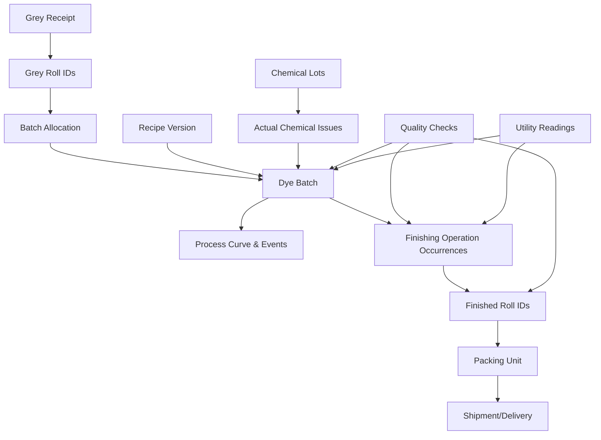
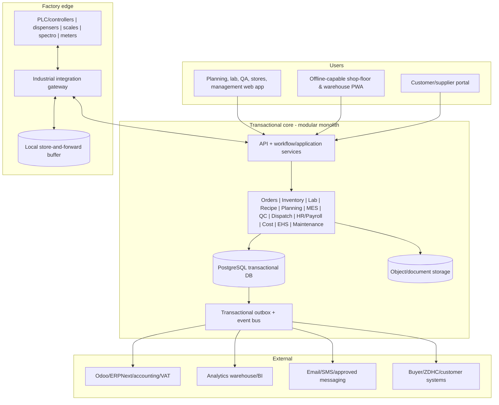

# Dyeing, Drying & Finishing ERP/MES System Design

**Core manufacturing scope:** Grey fabric receipt to finished-fabric delivery for a Bangladesh dyehouse  
**Horizontal ERP scope:** Procurement, inventory, costing, HR/payroll, maintenance, compliance, documents, approvals and accounting/VAT integration  
**Explicitly excluded:** Yarn production, knitting/weaving production, cutting, sewing/stitching, garment assembly and washing, printing, merchandising beyond the data needed to execute a dyeing order  
**Document status:** Project blueprint / discovery baseline, expanded for Bangladesh factory HR/payroll  
**Research date:** 7 September 2026  
**Recommended product name used in this document:** DyeFlow

**Companion specification:** [Bangladesh HR, Payroll, Attendance & Document Automation](./BANGLADESH_HR_PAYROLL_MODULE_DESIGN.md)

---

## 1. Executive decision

Build DyeFlow as a **dyehouse-specific ERP + Manufacturing Execution System (MES)**, not as a generic manufacturing screen with a few textile fields.

The system should have two tightly connected layers:

1. **ERP control layer:** customer contracts, dyeing orders, grey and finished inventory, purchasing, chemical stock, costing, quality release, billing, VAT documents, dispatch, HR/payroll, maintenance, compliance and management reporting.
2. **Dyehouse execution layer:** lab dips and recipe versions, batch formation and genealogy, finite-capacity machine scheduling, chemical dispensing, operator work queues, machine/controller data, dye curves, drying and finishing parameters, in-process quality, reprocessing and utility consumption.

The recommended implementation is a **modular monolith for business transactions plus event-driven edge integrations**. It is simpler and safer than starting with microservices, while still allowing machine gateways, optimization, analytics and customer portals to evolve independently.

The non-negotiable design principles are:

- Every physical roll, lot, batch, split, merge, chemical issue and delivery must be traceable.
- Customer-owned grey fabric must never be confused with company-owned stock.
- A production batch must preserve a frozen snapshot of the approved recipe and process route used at release time.
- Planned quantities, issued quantities, actual consumption, recovered/returned quantities, output and loss must reconcile.
- Quality failures create controlled hold/reprocess workflows; users must not be able to bypass them silently.
- Water, steam, gas, electricity, chemicals, wastewater and ETP records belong in the batch model, not in a disconnected sustainability spreadsheet.
- Shop-floor operation must continue during intermittent internet service. Machine control safety must remain local and independent of the cloud application.
- Every approval, override and master-data change must be attributable to a user, time, reason and previous value.

### Recommended delivery approach

- **Phase 0 – Discovery and master data:** map the actual factory, instruments, machines, routes, documents and approval limits.
- **Phase 1 – Transactional MVP:** orders, grey receipt, roll labels, lab dips, recipes, batch cards, production status, QC, finished stock and delivery; core employee, shift, biometric-attendance and document masters can run as a parallel workstream.
- **Phase 2 – Materials, costing and HR/payroll:** chemical procurement/stock, reservations, weighing, actual consumption, yield, reprocess, batch profitability, attendance approval, overtime, payroll and controlled PDF documents.
- **Phase 3 – Connected factory:** PLC/controller, spectrophotometer, dispenser, scale and utility-meter integration; automatic process curves and alarms.
- **Phase 4 – Optimization:** constraint-based scheduling, shade-family sequencing, predictive maintenance and anomaly detection.

Do not begin with AI scheduling or full machine automation. Reliable identifiers, measurements, transaction discipline and process interlocks create the data foundation those features require.

---

## 2. Research findings and why they matter

### 2.1 Bangladesh dyehouses need more than generic MRP

Bangladesh-focused dyeing ERP products consistently advertise lab-dip management, dyeing orders, planning, QC, packing, batch cards, labels, delivery challans, chemical issues, grey-to-finished reconciliation and commercial documents. These vendor claims are not neutral standards, but the repeated feature pattern is useful market evidence. Infocrat's local product describes lab dip, production planning, QC, packing, route sheets, batch cards, labels and delivery challans; another Bangladesh textile ERP emphasizes recipe control, dyehouse scheduling, grey-to-finished genealogy, subcontract WIP and export packs. [Infocrat](https://infocrat.com.bd/textile-dyeing-erp-software/) and [Codebond](https://www.codebondhuit.com/textile-erp-software-bangladesh) are therefore used as local market signals, not proof that any specific product is suitable.

The implications for DyeFlow are:

- The primary object is a **dyeing service order and transformation genealogy**, not merely a sales order plus a bill of materials.
- Roll identity, weight, ownership, shade, finish, buyer/style references and delivery commitment must travel together.
- Lab approval and bulk production are separate controlled processes.
- Batch scheduling is constrained by machine capacity, material, process compatibility, due date and changeover—not only by a calendar.
- Re-dye, correction, stripping and finishing rework are normal exception routes that must be designed explicitly.

### 2.2 Resource efficiency is both a cost and compliance requirement

IFC's Bangladesh Partnership for Cleaner Textile (PaCT) focused specifically on washing, dyeing and finishing, with reductions in water, energy, chemicals, wastewater and greenhouse-gas emissions as operational goals. IFC also launched a real-time analytics portal for Bangladeshi factories to monitor water and energy. [IFC PaCT II](https://disclosures.ifc.org/project-detail/AS/601585/pact-ii) and [IFC monitoring portal announcement](https://www.ifc.org/en/pressroom/2020/ifc-launches-web-portal-to-monitor-resource-usage-in-bangladeshs) support making resource metering and batch-normalized analytics core functionality.

Therefore DyeFlow should calculate, at minimum:

- Water L/kg processed
- Steam kg/kg or thermal-energy equivalent per kg
- Electricity kWh/kg
- Gas/Nm³ per kg where applicable
- Chemical and dyestuff kg/kg and cost/kg
- Wastewater L/kg
- ETP chemical cost/m³ and sludge kg/m³
- CO2e/kg using versioned emission factors

Values should be available by batch, machine, process route, shade family, fabric construction, customer, shift and period. Plant-level monthly totals alone cannot identify loss or explain a bad batch.

### 2.3 Environmental and chemical compliance must be configurable

Bangladesh's Department of Environment publishes the **Environment Conservation Rules 2023** and provides services for environmental clearance, ETP design approval and laboratory reports. The software should retain permits, renewal dates, sampling events, lab reports, discharge points and corrective actions, but legal thresholds must be maintained as versioned configuration rather than hard-coded. [Bangladesh DoE rules page](https://doe.gov.bd/pages/static-pages/6922e0a1933eb65569e27eba) and [DoE service portal](https://doe.gov.bd/).

Many export buyers also expect ZDHC-aligned chemical input and wastewater management. ZDHC requires a chemical inventory or equivalent record for production chemicals, and its wastewater guidance covers wet-processing wastewater and sludge, test data and reporting. ZDHC explicitly notes that its program does not replace national legal compliance. [ZDHC chemical purchasing](https://programme.roadmaptozero.com/suppliers/input/chemical-purchasing-v1), [ZDHC wastewater guidance](https://www.zdhc.org/zdhc-wastewater-guidelines), and [ZDHC sampling/reporting](https://programme.roadmaptozero.com/suppliers/output/wastewater-sludge-guidelines-v1/sample-and-test-wastewater).

Consequently, the compliance engine must support simultaneous rule profiles:

- Bangladesh legal profile
- Customer/brand profile
- ZDHC profile/version
- Certification profile such as OEKO-TEX, GOTS or GRS when contractually applicable
- Factory's stricter internal limits

At evaluation time, the system uses the strictest applicable active limit and records which profile/version produced the decision.

### 2.4 Bangladesh commercial localization cannot be an afterthought

The National Board of Revenue (NBR) says registered taxpayers should retain purchase/sales records and issue/receive VAT invoices in **Mushak-6.3** form. NBR publishes the official VAT forms and maintains a list of enlisted software firms. [NBR taxpayer responsibilities](https://nbr.gov.bd/taxtypes/vat-compliance-guides/details/8/eng), [NBR VAT forms](https://nbr.gov.bd/form/vat/vat-2012/uploads/public-notice/e-services/vatcalculator/ban), and [NBR enlisted software firms](https://nbr.gov.bd/nbr-enlisted/e-services/vatcalculator/eng).

DyeFlow should therefore support BDT, BIN/TIN/customer tax data, Bangla/English documents, fiscal periods, delivery challans and configurable Mushak outputs. Tax logic and forms must be validated by a Bangladesh VAT professional before go-live and updated when rules change. If statutory VAT software enlistment is required for the deployment, use an enlisted accounting/VAT product as the authoritative tax ledger or complete the applicable certification process; this design document does not make a legal eligibility determination.

### 2.5 Established products suggest a composable solution

- **Odoo 19** provides manufacturing orders, work centers, work-order dependencies, shop-floor screens, lot traceability, barcodes, quality control points, PLM change approval, maintenance and APIs. Those are useful ERP foundations. [Odoo Manufacturing](https://www.odoo.com/documentation/19.0/applications/inventory_and_mrp/manufacturing.html), [lots](https://www.odoo.com/documentation/19.0/applications/inventory_and_mrp/inventory/product_management/product_tracking/lots.html), [quality control points](https://www.odoo.com/documentation/19.0/applications/inventory_and_mrp/quality/quality_management/quality_control_points.html), and [work centers](https://www.odoo.com/documentation/19.0/applications/inventory_and_mrp/manufacturing/advanced_configuration/using_work_centers.html).
- **ERPNext** similarly provides work orders, job cards, batched inventory, material transfer/consumption and incoming/in-process/outgoing quality inspections. [ERPNext Work Order](https://docs.frappe.io/erpnext/work-order), [Batch](https://docs.frappe.io/erpnext/batch), and [Quality Inspection](https://docs.frappe.io/erpnext/quality-inspection).
- **Datatex NOW** models textile-specific production, machine scheduling, material/capacity reservation, shop-floor activity, quality and cost control, showing the value of a textile-aware domain model. [Datatex Production](https://datatex.com/portfolio-items/production/) and [NOW ERP](https://datatex.com/portfolio-items/now-network-oriented-world/).
- **SedoMaster** connects dyehouse planning, machine controllers, recipes, chemical dispensing, inventory, batch reports and consumption reporting. This is the appropriate reference category for the MES boundary. [SedoMaster](https://www.sedo-treepoint.com/products/software/mes-systems/sedomaster/).
- **Datacolor** shows why formulation, spectrophotometers, lab/production equipment, recipe optimization and ERP integration should be separate specialist capabilities with clean interfaces. [Datacolor formulation software](https://www.datacolor.com/business-solutions/color-formulation-software/).

The practical conclusion is: use or build a stable ERP foundation, but implement a purpose-built dyehouse domain and integration layer. A generic BOM must not become the only representation of a dye recipe, dye curve, correction history or roll genealogy.

### 2.6 Bangladesh compatibility conclusion

The production design matches the commonly described Bangladesh dyehouse flow: grey inspection/receipt, batching, pretreatment, dyeing, dewatering, drying, compacting/finishing, final inspection, packing and delivery, with lab-dip, recipe, chemical issue, reprocess and batch-card control. The sequence is also visible in Bangladesh-oriented ERP products and regional dyeing ERP descriptions. [Infocrat dyeing ERP](https://infocrat.com.bd/textile-dyeing-erp-software/) and [ITSKY dyeing workflow](https://itskytechnology.com/industry-solutions/erp-for-knitting-dyeing-industry/) are market references; official sources govern regulation.

It is **not truthful to claim that one hard-coded layout will work unchanged in every dyehouse**. A compatible product must ship with factory profiles and configuration for:

- standalone commission dyeing versus in-house/group orders;
- customer-owned versus company-owned grey and chemicals;
- general-factory versus EPZ labour/payroll regime;
- knit tubular/open-width and any approved woven routes;
- cotton/reactive, polyester/disperse, blends and other validated chemistry/process templates;
- manual, semi-automated and controller-connected machines;
- kg plus roll/meter/yard measurement practices;
- customer/buyer specifications, approvals, labels and document formats;
- Bangla/English terminology, signatures, numbering and A4 print layouts;
- factory-specific machine sequence, quality gates, loss tolerance and approval limits.

The product is reusable across factories when these differences are configuration and versioned master data—not source-code forks. Factory implementation still requires discovery, master-data loading, document mapping, device integration and user acceptance.

### Complete application navigation

```text
Executive Dashboard
├── CRM, Quotation & Dyeing Orders
├── Gate, Grey Receipt & Grey Store
├── Lab Dip, Color & Recipe
├── Planning, Batch & Schedule
├── Dye/Chemical Store & Dispensing
├── Dyeing Shop Floor / MES
├── Drying & Finishing
├── Quality, Reprocess & CAPA
├── Finished Fabric, Packing & Delivery
├── Procurement & Suppliers
├── Costing & Finance/VAT Handoff
├── HR, Attendance, Payroll & Documents
├── Maintenance, Calibration & Spares
├── EHS, Utilities, ETP & Sustainability
├── Customer/Supplier/Employee Portals
├── Reports, BI & Audit
└── Administration, Masters & Integrations
```

Factories may hide modules they do not use, but all deployments share the same canonical order, roll, batch, employee, document and audit semantics.

---

## 3. Scope and operating assumptions

### 3.1 Included process boundary

The transaction boundary begins when a vehicle/party brings grey fabric to the factory gate and ends when finished rolls leave with an authorized delivery.

Included:

- Dyeing service inquiry, quotation and order/booking
- Customer, buyer, brand, style/PO/color references needed by production
- Customer-owned, company-owned and subcontract material ownership
- Gate entry, challan capture, grey fabric receipt, weighing and inspection
- Roll/lot labels and location management
- Lab-dip request, trials, measurement, submission, comment rounds and approval
- Recipe, process-route and finishing-specification version control
- Capacity planning and detailed batch/machine scheduling
- Grey allocation, batch creation, roll split/merge and batch card
- Dye/chemical reservation, requisition, weighing, dispensing, issue, return and reconciliation
- Pretreatment performed within the dyehouse route
- Dyeing execution and machine process-curve capture
- Hydro extraction/dewatering, slitting/opening where relevant, drying, stentering, compacting/calendering/other configured finishing operations
- In-process and final quality checks, quarantine, nonconformance and reprocessing
- Finished roll inspection, shade grouping, packing, stock and delivery allocation
- Dispatch, gate pass, delivery challan, invoice handoff and customer proof of receipt
- Batch costing, variance, yield/loss, productivity and on-time delivery
- Utilities, ETP, wastewater/sludge records, chemical compliance and audit evidence
- Equipment, calibration and preventive/corrective maintenance
- Full employee lifecycle, organization/organogram, recruitment, appointment, service records, shift/roster, biometric attendance, leave, overtime, payroll, bonus, loan/advance, benefits, tax/PF/gratuity configuration, notices, letters, final settlement and employee self-service
- Notifications, approvals, dashboards, document storage, audit log and integrations

### 3.2 Excluded

- Yarn procurement/production and spinning
- Knitting or weaving planning and production
- Garment cutting, sewing/stitching and assembly
- Garment washing
- Textile printing
- Merchandising/PLM functions unrelated to the dyeing job
- Treasury, banking, LC/bond/customs and general ledger in the first product release

These excluded business functions can integrate with the system. Their reference numbers may be stored on an order, but their workflows are not owned by DyeFlow.

### 3.3 Factory assumptions to validate in discovery

- Primary material is fabric in rolls, recorded in kg and often also meters/yards.
- The plant may process tubular and open-width knit fabric and may later need woven-fabric routes.
- Most production is make-to-order/job work; both customer-supplied and company-owned grey are possible.
- A dyeing batch can consume many grey rolls; outputs can become different roll boundaries after opening/finishing.
- One customer order/color can be split across multiple dye batches and finish lots.
- Reprocessing is frequent enough to require explicit orders and cost ownership.
- Operators need Bangla-friendly, scan-first screens; supervisors and managers need English/Bangla configurable reports.
- Some machines expose modern industrial interfaces; others require manual capture, file exchange or retrofit meters.

---

## 4. People, roles and separation of duties

| Role | Primary responsibilities | Restrictions / controls |
|---|---|---|
| Gate/security | Vehicle entry, challan reference, seal/vehicle/driver, gate exit | Cannot accept stock or edit weights |
| Grey store receiver | Weigh, inspect, identify, label, bin and accept/quarantine rolls | Cannot approve commercial over-receipt |
| Sales/commercial | Quote, order, rate, tax, customer promise, delivery program | Cannot approve own exceptional discount above threshold |
| Planning | Allocate material, form batches, choose route/machine, publish schedule | Cannot edit approved recipe content |
| Lab technician | Lab trials, measurements, sample preparation | Cannot self-approve customer/buyer shade unless policy permits |
| Lab/technical manager | Recipe and lab-dip approval, bulk release, correction approval | Approval signature required for recipe activation |
| Chemical store | Receive, quarantine, issue, return, cycle count, expiry | Cannot alter a released requisition quantity without reason/approval |
| Weighing/dispensing operator | Scan requisition, container and scale; prepare issue | Cannot substitute chemicals without authorized deviation |
| Dyeing operator | Load, scan, start/stop, confirm steps and exceptions | Cannot start if interlocks fail; cannot change frozen recipe |
| Finishing operator | Execute drying/finishing route and enter/capture parameters | Cannot skip mandatory QC points |
| Quality inspector | Sampling, shade and physical test results, hold/release request | Cannot edit test method/specification |
| QA manager | Release, concession, reprocess disposition, CAPA | Concession requires customer authority where configured |
| Maintenance | Equipment, breakdown, PM, spare parts, calibration | Cannot close safety-critical PM without required evidence |
| EHS/ETP | Chemical compliance, wastewater, sludge, ETP operation, permits | Cannot backdate tests without explicit audited override |
| Dispatch | Pick, pack, verify, load, issue delivery documents | Cannot ship held or un-released rolls |
| Finance/VAT | Invoice, tax document, receivables, period close | Cannot alter production quantities; adjustments use controlled documents |
| System administrator | Users, roles, devices, configuration | Should not approve business transactions by default |
| Auditor/read-only | Search genealogy, view documents/logs and export evidence | No mutation rights |

Use role-based access plus contextual rules such as site, department, customer confidentiality and monetary/quantity approval limits. Emergency administrator access must be time-limited and fully logged.

---

## 5. End-to-end operating workflow


### 5.1 Stage controls

| Stage | Required input | System automation | Output / release gate |
|---|---|---|---|
| 1. Gate entry | Customer/supplier, vehicle, driver, source challan, expected order | Duplicate-challan check; expected receipt lookup; timestamp/photo | Gate-entry token |
| 2. Grey receipt | Roll count, scale weight, declared weight, fabric attributes, ownership | Scale capture; variance calculation; internal roll IDs/QR labels | Accepted, partial, excess or quarantined receipt |
| 3. Grey inspection | Construction, composition, GSM, width/dia, visible defects, contamination | Sampling checklist; tolerance evaluation; photo evidence | Available or held grey rolls |
| 4. Order confirmation | Customer, buyer/style/PO, color, finish, quantity, rate, due date and specifications | Credit/commercial/feasibility checks; spec completeness check | Released dyeing order line |
| 5. Lab dip | Standard/sample/digital target, substrate, requested light sources | Trial numbering, formula calculation, instrument import, submission reminders | Approved lab dip linked to a recipe version |
| 6. Recipe/process release | Approved shade, substrate, machine class, liquor ratio, route, chemical lines and curve | Maker-checker; version hash; MRSL/compliance check; standard cost | Effective production recipe/process version |
| 7. Batch formation | Eligible grey rolls, requested kg, route, shade, delivery priority | Compatibility rules; weight/capacity tolerance; genealogy edges | Planned batch with roll allocation |
| 8. Detailed scheduling | Batch, eligible machines, setup/cleanup, shifts, maintenance, material readiness | Finite capacity; due-date risk; shade-family sequence; conflict detection | Frozen near-term schedule / operator queue |
| 9. Material staging | Released batch/recipe, available conformant chemical lots | Reservation, FEFO proposal, scaled requirement, shortage alerts | Approved requisition/pick list |
| 10. Weigh/dispense | Requisition, chemical lot/container, calibrated scale | Scan verification; tolerance; actual weight capture; label; interlock | Dispense container associated with batch/step |
| 11. Machine loading | Scheduled machine, verified rolls, operator authorization | Machine/roll scan; weight/capacity and route checks | Load confirmation and WIP transfer |
| 12. Dyeing | Frozen recipe/process, machine program, staged chemicals | Controller program transfer where safe; live curve, alarms, step confirmations, actual resource data | Completed dye cycle with immutable execution record |
| 13. Off-machine QC | Sample identity, approved standard, light conditions | Instrument result import; ΔE/assessment; pass/hold rule | Pass to finishing or controlled correction/re-dye order |
| 14. Drying/finishing | Route and target width/GSM/handfeel/shrinkage | Machine queue; parameter download/capture; speed/temp/overfeed monitoring | Finished lot awaiting final QC |
| 15. Final QC | Finished rolls, sampling plan, test specification | Mandatory tests; calculated verdict; defect map; shade group suggestion | QA release, hold, concession or rework |
| 16. Finished receipt | Actual roll lengths/weights, grade and shade group | New roll labels; yield/loss calculation; order balance update | Released finished inventory |
| 17. Packing/allocation | Delivery program, released compatible rolls | FIFO/FEFO or shade-group allocation; no mixed shade group unless permitted | Packing list and staged shipment |
| 18. Dispatch/delivery | Authorized vehicle/receiver, staged rolls, commercial release | Scan-out verification, duplicate prevention, challan/VAT handoff, proof of delivery | Closed/part-delivered order and traceable shipment |

### 5.2 Critical exception workflows

The design must treat exceptions as structured work, not remarks fields:

- **Receipt variance:** short/excess weight, roll-count mismatch, wrong construction or missing reference.
- **Grey defect/contamination:** quarantine with disposition: accept by concession, return, segregate or downgrade.
- **Lab-dip rejection:** new trial linked to prior trial and buyer comment; never overwrite the rejected formula.
- **Chemical shortage:** substitute only through an approved recipe deviation or revised recipe.
- **Machine breakdown:** stop event, WIP status, alternate-machine feasibility, maintenance request and replanning.
- **Dye-curve deviation:** parameter/alarm captured automatically; technical disposition required.
- **Shade correction:** separate correction recipe and actual consumption; original batch remains traceable.
- **Strip/re-dye:** new reprocess order with reason, responsibility and incremental cost.
- **Finishing rework:** new route occurrence rather than editing the completed run.
- **QC concession:** specification failure plus approver/customer authorization; released as concession, not pass.
- **Lost/damaged roll:** controlled inventory adjustment with investigation, evidence and approval.
- **Customer return:** link returned roll to shipment, original genealogy, complaint, analysis and corrective action.

---

## 6. Functional module design

### 6.1 Master data and governance

Maintain effective-dated and approved masters for:

- Legal entities, factories, warehouses, zones, bins, cost centers and shifts
- Customers, buying houses, brands/buyers, suppliers and subcontractors
- Fabric constructions: material composition, knit/woven type, structure, nominal GSM, width/dia, tubular/open-width state and permitted tolerances
- Colors/shades, color families, standards, light sources and buyer naming/code aliases
- Finishes and finishing specifications
- Units of measure: kg, g, L, mL, meter, yard, roll, drum, bag; permitted conversions and precision
- Dyes, chemicals, auxiliaries, commodity chemicals and ETP chemicals
- CAS number where applicable, SDS, hazard class, storage rules, shelf life, approved supplier/product, ZDHC/MRSL evidence and certificate validity
- Machines, machine groups/classes, nominal/min/max load, chamber/nozzle configuration, material compatibility, liquor-ratio range, speed/temperature/pressure limits, controller interface and energy meters
- Work centers and operations
- Quality tests, methods, instruments, specifications, sampling plans and defect catalogs
- Process routes, operation parameters and standard times
- Numbering sequences, reason codes, approval matrices, document templates and notification rules

Controls:

- No hard delete after transactional use.
- Changes create a new effective version.
- High-risk masters require maker-checker approval.
- Import validates duplicates, UoM dimensions and referential integrity before commit.
- Every document displays master version/effective date used.

### 6.2 Customer order and commercial control

Key functions:

- Inquiry/quotation for dyeing and finishing service by kg/meter/yard.
- Price components: base dyeing, shade depth/surcharge, special finish, testing, packaging, reprocessing responsibility, tax and transport.
- Dyeing order with multiple color/finish lines and delivery schedules.
- References for buyer, brand, style, PO, fabric booking, internal job, LC/UD/bond where supplied by an upstream ERP.
- Technical specification attachment and structured tolerances.
- Expected grey quantity including agreed process allowance.
- Customer-owned material liability and stock statement.
- Commercial, credit and technical-feasibility approval gates.
- Partial material receipt, partial production and partial delivery.
- Change-order control after production planning or receipt.
- Customer portal/API for order status, lab approvals, certificates and delivery documents in a later phase.

### 6.3 Gate, grey store and roll management

Key functions:

- Expected and unexpected receipt flows.
- Source challan uniqueness by party and date/series.
- Optional weighbridge gross/tare/net and mandatory roll-level or lot-level weights per policy.
- Internal immutable roll ID and QR/Code 128 label; optional RFID later.
- Record supplier/customer roll number without using it as the internal key.
- Ownership ledger: customer, company, subcontractor; title transfer rules configurable.
- Attributes at receipt: construction, composition, GSM, width/dia, color state, roll count, weight, length, yarn lot/grey lot references if supplied.
- Grey inspection with defect, contamination, oil mark, mildew/wetness and identity checks.
- Quarantine, available, reserved and return zones.
- Aging, unidentified stock and order-unmatched receipt reports.
- Mobile scanning for receive, move, count, reserve, issue and return.

**Dual-UoM rule:** kg is normally the stock/cost basis, while meters/yards and rolls are parallel measured quantities. Do not derive length from a permanent conversion factor when actual roll measurement exists. Store each measurement, device/source, time and uncertainty/tolerance.

### 6.4 Lab, color and recipe management

Key functions:

- Lab-dip request per order/color/substrate/finish.
- Physical swatch/sample identity, image and storage location.
- Digital target: L\*a\*b\*, spectral curve, illuminant/observer, tolerance and customer method.
- Trials A/B/C and unlimited later rounds; each trial is immutable after submission.
- Formula lines expressed as % owf, g/L, absolute quantity or stage-specific rule.
- Cost calculation and comparison across trial formulas.
- Spectrophotometer/color-matching import; avoid manual retyping.
- Record metamerism, color strength and visual assessment under configured light sources.
- Submission, buyer comment, rejected/resubmit, approved and expired/superseded states.
- Lab-to-bulk scale-up rules based on substrate, machine class, load, liquor ratio and correction factor.
- Recipe families with version, effective date, approval, applicability and supersession.
- Separate **chemical formula** from **process program/curve** and **finish route**, then bundle approved versions into a production recipe release.
- Electronic signature/hash and comparison of revisions.
- Bulk feedback loop: first-time-right result, actual recipe, deviation and correction update future recommendations without rewriting history.

### 6.5 Batch planning and finite scheduling

Key constraints:

- Order priority and promised delivery date
- Approved lab dip/recipe availability
- Grey availability, ownership, compatibility and reservation
- Machine class, min/max/nominal load and permissible underload/overload
- Fabric construction/composition, tubular/open width and route compatibility
- Shade/color-family sequence and cleaning/changeover requirements
- Process duration, setup, cleanup, cooling and sample/QC wait time
- Chemical availability and dispensing capacity
- Finishing bottleneck capacity, not only dyeing capacity
- Shift calendar, holidays, planned maintenance and operator skills
- Already-running/frozen batches and customer priority rules

Planner capabilities:

- Drag/drop Gantt with constraint validation.
- Earliest feasible start and projected completion.
- What-if scenario without changing the published plan.
- Freeze horizon (for example next 8–12 hours) and controlled override.
- Split one order across batches; combine compatible order lines only with explicit customer/traceability policy.
- Balance utilization against due-date risk; do not optimize only for full machines.
- Publish a revisioned schedule and push work queues to operator terminals.
- Record planned-versus-actual start/end and reason-coded delay.

### 6.6 Dye and chemical inventory

Key functions:

- Purchase request, PO/ERP interface, receipt, supplier lot, internal lot, COA/SDS and incoming QC.
- Quarantine until quality/compliance release.
- Bin/container identity and capacity; drum/bag tracking where useful.
- Lot potency/strength or assay factor and recipe adjustment policy.
- Expiry/retention date and FEFO allocation.
- Safety stock, reorder point and demand from released/planned batches.
- Reservation without premature consumption.
- Requisition by batch and process step.
- Scan-and-weigh issue with tolerance and second-person verification for critical substances.
- Partial issue, top-up, return, spill, waste and empty-container handling.
- Actual consumption from weighed quantities/dispensing system, not standard backflush alone.
- Stock ledger, cycle count, variance approval and lot recall.
- MRSL/customer compliance status at procurement, receipt, reservation and issue.
- Storage compatibility, hazard signage, PPE/instruction attachment and expiry alerts.

### 6.7 Shop-floor and dyeing execution

Operator interface must be touch-friendly, scan-first and usable with gloves where hardware permits.

Functions:

- Work queue by machine/work center with priority and readiness.
- Scan employee, machine, batch, rolls and dispensed containers.
- Pre-start checklist: recipe released, material correct, machine available, maintenance/calibration valid, load within limit and chemicals complete.
- Electronic batch card and step-by-step instructions.
- Controlled program download or program-ID verification.
- Start, pause, resume, sample, hold and complete events.
- Automatic capture where available: temperature, time, pressure, flow, pH, conductivity, RPM, water level, dosing events, alarms and operator interventions.
- Manual readings with source and reason when no instrument interface exists.
- Actual utility allocation from machine meter, header/submeter model or calculated estimate, with confidence indicator.
- Sample request and lab queue.
- Deviation acknowledgment/escalation; critical alarms cannot be cleared only with a free-text note.
- Electronic handover between shifts.
- Offline local queue with idempotent synchronization after connectivity returns.

**Safety boundary:** DyeFlow may send an approved program or set point only through a validated machine interface. PLC safety logic, emergency stops, maximum limits and local interlocks remain authoritative. Loss of ERP/MES connectivity must not disable safe machine control.

### 6.8 Drying and finishing execution

Configurable routes may include hydro extraction/dewatering, slitting/opening, drying, stenter, compactor, calender or other factory-defined operations.

For every run capture:

- Input lot/batch/rolls and weight/length
- Machine and operator/shift
- Start/end/downtime
- Recipe/finish chemical application
- Target and actual temperature zones, speed, overfeed, width setting, pressure and moisture where applicable
- Sample/check results during the run
- Output weight/length/roll mapping
- Waste/edge trim and reason
- Energy and chemical use where metered

The finishing route is a sequence of **operation occurrences**. Repeating stenter or compactor creates a second occurrence. It must not overwrite the first run.

### 6.9 Quality management

Quality checkpoints should be generated automatically from the active specification and route.

Potential checks, configured by product/customer, include:

- Grey: construction, composition evidence, GSM, width/dia, roll weight/length, visible defects and contamination
- Lab/bulk shade: visual assessment, spectral/L\*a\*b\*, ΔE method/tolerance, metamerism and shade group
- Dyeing process: pH, temperature/time conformity, absorbency or wash-off checks
- Finishing: GSM, usable/open width, dimensional stability/shrinkage, spirality/skew, bowing, handfeel/moisture
- Performance: color fastness to wash/rubbing/perspiration/light as required, bursting/tensile strength, pilling and customer-specific tests
- Final roll inspection: defect points/map, grade, length/weight and packing condition

Functions:

- Specification version and applicable sampling plan frozen on the quality check.
- Instrument ID, calibration status, test method, conditions and raw result attachment.
- Automatic tolerance verdict with authorized manual disposition kept separately.
- Pass, fail, hold, re-test, concession, rework, reject and return dispositions.
- Nonconformance, root cause, corrective/preventive action (CAPA), effectiveness review and responsibility.
- Retained sample location and retention period.
- Certificate of Analysis / test report generation.
- Customer complaint linked back to rolls, batches, chemical lots, machines, operators, process curves and prior similar failures.

### 6.10 Finished fabric, packing and dispatch

Key functions:

- Create finished roll identities and maintain genealogy to all contributing grey rolls and batch operations.
- Capture measured kg and meter/yard, width, GSM, grade and shade group per roll.
- Quarantine until QA release.
- Reserve delivery by order, buyer/style/color, required shade group and tolerance.
- Prevent mixing shade groups or non-compatible lots unless customer rule permits.
- Packing configuration: roll/poly/carton/pallet, label format and customer data.
- Pick list, scan verification, packing list, delivery challan, gate pass and invoice request.
- Vehicle/driver/receiver, seal, loading time and proof of delivery.
- Partial delivery and order-balance reconciliation.
- Returnable packaging/pallet tracking if used.
- Customer-owned grey balance statement showing received, in process, finished, delivered, loss and return.

### 6.11 Costing and finance handoff

Calculate standard, current estimate and actual cost per order/batch/kg:

- Dyes and chemicals by actual lot cost and actual issue
- Water, electricity, gas/steam/thermal energy
- Direct labor and machine time
- Setup/cleaning and testing
- Packaging, transport and subcontract operation
- ETP variable cost and waste disposal
- Reprocess/correction incremental cost
- Allocated overhead using a versioned driver

Provide variance decomposition:

- Price versus usage variance
- Recipe standard versus actual chemical use
- Planned versus actual machine hours
- Planned versus actual utilities
- Expected versus actual yield/loss
- First-pass versus reprocess cost

Post summarized, balanced entries or invoices to the finance/VAT system. Preserve the source batch/order references for drill-down. Do not make analytics tables the accounting ledger.

### 6.12 Maintenance and calibration

- Equipment hierarchy: plant → area → work center → machine → component/meter/instrument.
- Preventive plan by time, runtime, batch count or meter reading.
- Breakdown request directly from operator screen with severity and current batch.
- Safety lockout/status blocks scheduling and machine start.
- Spare-part issue and maintenance cost.
- MTBF, MTTR, downtime reason and repeat-failure analysis.
- Calibration schedule/certificate for scales, spectrophotometers, pH meters, thermometers, flow meters and lab instruments.
- Prevent use or require approved override when calibration is expired.
- Link maintenance event to process deviation/quality failure where relevant.

### 6.13 EHS, ETP and sustainability

- Chemical inventory with SDS, hazard, storage, certification and supplier evidence.
- Permit/certificate register with owner, issue/expiry, renewal workflow and document.
- Water source and meter hierarchy; electricity/gas/steam meter hierarchy.
- ETP shift log: influent/effluent flow, operating parameters, chemical use, downtime and bypass prohibition/control.
- Wastewater/sludge sampling plan, chain of custody, lab, parameter results, limits and corrective action.
- Sludge generation, classification, storage, transporter and disposal evidence.
- Spill/incident record, response, photos and CAPA.
- Batch-to-resource mass balance and site water/energy/chemical balance.
- Customer/brand/ZDHC report export with profile/version and evidence.
- Emission-factor registry with geography/source/effective dates; calculated CO2e values must retain the factor version.

### 6.14 HR, attendance, payroll and employee documents

HR/payroll is a first-class ERP domain, but its legal/payroll records remain separated from production-performance data. The module covers recruitment through final settlement, organization and approved organogram, worker/employee master, contracts, appointment letters, ID cards, service books, biometric attendance, shift/relay rosters, leave, overtime authorization and calculation, salary structures, payroll, bonus, loan/advance, deductions, benefits, tax, provident fund/gratuity configuration, training, grievance/discipline, notices, letters, bank/mobile-payment advice and employee self-service.

Every tenant owns one effective-dated **two-shift, two-crew dyehouse profile** per site: a 12-hour Day shift and contiguous 12-hour Night shift covering 24 hours. Tenant-selected starts such as 08:00/20:00 or 08:30/20:30 drive both boundaries. Crew A and Crew B exchange Day/Night weekly, with Saturday supported as the default Bangladesh change day. The ERP does not expose generic three-shift, flex, split or open-shift patterns for this scoped product. It separately records the 12-hour roster span, breaks, regular minutes, candidate OT, authorized OT and payable OT so factory coverage does not become an unsupported payroll assumption.

The design principle is **24/7 factory coverage without 24-hour worker duty**. At every boundary the outgoing crew records a production/process/safety handover and leaves; the incoming crew continues the running batch. Over each two-week cycle both crews receive one Day week and one Night week, sharing Night duty and preserving time for sleep, recovery and personal life. Per-worker overlap, rest and Day/Night fairness checks are mandatory roster validations.

For a staffed Friday weekly off-day/holiday, an optional tenant policy converts Thursday 20:00–Saturday 08:00 into two continuous 18-hour blocks: outgoing Night works Thursday 20:00–Friday 14:00, with six additional operational OT hours; outgoing Day works Friday 14:00–Saturday 08:00 as holiday-duty OT. The crews then resume in swapped positions on Saturday. H1/H2 roles reverse at the next weekly rotation, distributing holiday OT between both crews. Weekly-off and festival-holiday compensation remain legally distinct, and an 18-hour duty raises a blocking compliance exception unless the establishment records an approved legal basis or exemption.

Bangladesh compatibility requires effective-dated regulatory profiles rather than one fixed formula. A legal establishment selects the applicable general-factory or EPZ regime, industry/minimum-wage gazette, grade, employment class, working-time rules, leave policy, overtime basis and tax year. The payroll engine stores the exact rule/version and input snapshot used for each finalized result.

Official Bangladesh sources support maintaining worker/service records, appointment/identity documentation, attendance/overtime registers, working-hours notices and wage registers/slips. The current legal baseline must include the Bangladesh Labour Act as amended through 2026 and the applicable Labour Rules; factories in an EPZ must instead apply the relevant EPZ Act/Rules and wage profile. See the detailed [HR/payroll companion specification](./BANGLADESH_HR_PAYROLL_MODULE_DESIGN.md), which defines:

- biometric normalization and overnight-shift logic;
- tenant-owned two-shift pairs, Crew A/B weekly Day/Night rotation and conflict-safe roster generation;
- Friday/holiday H1/H2 continuous-production bridge, replacement and OT-fairness ledger;
- per-tenant OT operating modes, policy resolution and external import/reconciliation;
- pre-authorized versus actually worked versus payable overtime;
- Form 34-style attendance/overtime and Form 38-style wage outputs;
- salary/OT sheets, payslips and bonus/final-settlement PDFs;
- automated notice-board publications and employee-specific letters;
- maker-checker payroll, bank/mobile-financial-service files and reconciliation;
- privacy, audit, correction, reversal and signed-document controls.

Sources: [Bangladesh Labour Act consolidated text](https://bdlaws.minlaw.gov.bd/act-print-952.html), [Bangladesh Labour (Amendment) Act 2026](https://dife.gov.bd/pages/laws/%E0%A6%AC%E0%A6%BE%E0%A6%82%E0%A6%B2%E0%A6%BE%E0%A6%A6%E0%A7%87%E0%A6%B6-%E0%A6%B6%E0%A7%8D%E0%A6%B0%E0%A6%AE-%E0%A6%B8%E0%A6%82%E0%A6%B6%E0%A7%8B%E0%A6%A7%E0%A6%A8-%E0%A6%86%E0%A6%87%E0%A6%A8-%E0%A7%A8%E0%A7%A6%E0%A7%A8%E0%A7%AC-yy84ye-6a097f157aa29b4dab974311), [Labour Rules 2015 and 2022 amendment index](https://dife.portal.gov.bd/pages/static-pages/6922dc42933eb65569e0f517), [DIFE services/working-hours notice](https://dife.gov.bd/pages/static-pages/6922de9c933eb65569e1bf97), and [BEPZA labour/minimum-wage sources](https://www.bepza.gov.bd/public/acts-policies).

---

## 7. Automation catalogue and priorities

Legend: **P0** required for a usable MVP, **P1** high-value next release, **P2** advanced optimization.

| Automation | Priority | Trigger → action | Human/control gate |
|---|---:|---|---|
| Expected receipt match | P0 | Scan source challan/order → show expected rolls/quantity/ownership | Receiver confirms physical receipt |
| Roll identity | P0 | Accept roll → generate immutable ID and print QR label | Reprint is logged; identity cannot be reused |
| Weight variance | P0 | Scale/entry differs from declared tolerance → hold/approval task | Store/commercial disposition |
| Lab-dip workflow | P0 | Trial submitted/rejected/approved → route task and notify | Authorized approval required |
| Recipe scaling | P0 | Batch weight/liquor ratio set → calculate requirements by formula basis | Technical release freezes result |
| Recipe compliance | P0 | Release/issue → check expired, blocked or nonconformant chemicals | Technical/EHS deviation approval |
| Batch compatibility | P0 | Add roll/order line → validate ownership, fabric, shade, route and customer mixing rules | Planner resolves violations |
| Machine load check | P0 | Assign batch → validate min/max and material capability | Approved overload/underload policy only |
| Material reservation | P0 | Release batch → reserve FEFO conformant lots and report shortage | Store can propose, not silently substitute |
| Scan-and-weigh | P0 | Scan batch/requisition/chemical/scale → capture actual and tolerance | Critical out-of-tolerance blocks completion |
| Shop-floor readiness | P0 | Attempt start → check recipe, rolls, chemical, machine, calibration and QC gates | Supervisor override with reason where allowed |
| Mandatory QC | P0 | Complete configured operation → generate tests/checks | Cannot release/ship until disposition |
| Quality verdict | P0 | Save results → compare with frozen specification | QA may disposition; raw result unchanged |
| Reprocess creation | P0 | QA chooses correction/re-dye/re-finish → create linked order and costing | Technical approval of route/recipe |
| Inventory posting | P0 | Receipt/issue/output/delivery validated → atomic stock-ledger posting | Reversal document; no direct deletion |
| Dispatch verification | P0 | Scan staged roll → validate order, release, shade group and duplicate | Dispatch supervisor handles exception |
| Customer grey reconciliation | P0 | Any transformation/move → update received/WIP/output/delivered/loss view | Approved adjustments only |
| Notification/escalation | P1 | Deadline, hold age, shortage, breakdown, approval delay → notify/escalate | Configurable quiet hours and responsibility |
| Holiday bridge roster | P0 | Staffed weekly off/holiday → generate H1 18h and H2 18h, swap crews and allocate OT candidates | HR/compliance approval and legal-evidence gate |
| Spectrophotometer import | P1 | Instrument exports result → associate target/sample and evaluate | Technician verifies sample identity |
| Controller curve capture | P1 | Machine runs → stream/tag readings and alarms to batch | MES cannot bypass PLC safety |
| Program verification/download | P1 | Batch ready → verify/send approved program ID/version | Machine and recipe compatibility check |
| Utility allocation | P1 | Meter readings/events arrive → allocate to machine/batch with quality flag | EHS reviews missing/estimated data |
| PM from runtime | P1 | Runtime/batch threshold reached → maintenance work order and schedule block | Maintenance closes with evidence |
| ETP limit alert | P1 | Lab/online sensor crosses active limit → incident/CAPA notification | EHS verifies sensor/test and action |
| NBR document handoff | P1 | Invoice/delivery reaches taxable event → produce accounting/VAT payload | Finance validates current tax treatment |
| Customer status portal | P1 | Order state/approval/document changes → publish permitted fields | Customer-specific access policy |
| Finite schedule suggestions | P1 | Demand/capacity/material changes → recompute feasible plan | Planner publishes revision |
| Shade-family sequencing | P2 | Scheduler compares alternatives → minimize cleaning/changeover subject to due dates | Planner accepts suggestion |
| Recipe recommendation | P2 | Similar approved history found → suggest formula/correction factors | Colorist owns final formula |
| Anomaly detection | P2 | Live curve differs from historical good runs → early warning | Operator/technical manager decides action |
| Predictive maintenance | P2 | Sensor/failure patterns indicate risk → maintenance recommendation | Maintenance plans intervention |

### Automation maturity levels

1. **Digitize:** structured records and approvals replace paper/spreadsheets.
2. **Identify:** QR/barcode scanning ensures material and operation identity.
3. **Measure:** instruments, scales, controllers and meters provide actual values.
4. **Control:** workflow rules and interlocks prevent invalid actions.
5. **Optimize:** algorithms recommend schedules, recipes and maintenance.

Each factory area can progress independently, but a level must not be claimed until data completeness and reconciliation targets are met.

---

## 8. State models and non-negotiable business rules

### 8.1 Principal state machines

**Dyeing order**  
`Draft → Commercial review → Technical review → Awaiting grey/lab approval → Released → In production → Ready/part ready → Part delivered → Delivered → Closed`  
Side states: `On hold`, `Cancelled`.

**Lab dip**  
`Requested → Trial in progress → Internal review → Submitted → Approved` or `Rejected → New trial`; approved records can become `Superseded` or `Expired`.

**Grey roll**  
`Expected → Received/quarantine → Available → Reserved → Issued to batch → Consumed/transformed`; exception states: `Held`, `Return staged`, `Returned`, `Lost/damaged`.

**Production batch**  
`Draft → Planned → Material reserved → Released → Staged → Loading → Running → Sample/technical hold → Dyeing complete → Finishing → Final QC → Released → Finished-stock posted → Closed`.

Reprocessing creates a linked route occurrence: `Correction planned`, `Re-dye planned`, `Re-finish planned`, `Rejected`. It does not roll the batch backward and erase completed history.

**Finished roll**  
`Created/quarantine → QC released → Available → Reserved → Packed → Staged → Shipped → Delivered`; exception states: `Held`, `Rework`, `Customer returned`, `Scrapped`.

### 8.2 Business invariants

1. A stock movement posts only once and must balance source/destination/ownership.
2. Posted inventory and financial transactions are reversed, never edited or deleted.
3. A physical roll ID is unique for life, even after consumption or return.
4. Transformations retain parent-child genealogy; splits and merges cannot create or lose unexplained quantity.
5. Customer-owned stock cannot satisfy another customer's order unless a documented ownership transfer is approved.
6. A batch starts only with an effective approved recipe/process bundle or an explicitly approved development-batch route.
7. Recipe and specification snapshots on released batches/checks are immutable.
8. Actual chemical consumption is never replaced by a recalculated standard.
9. Failed mandatory QC keeps the material on hold until authorized disposition.
10. Concession is distinct from pass and retains failed values and authority.
11. A held, unreleased, expired or wrong-shade-group roll cannot be packed/shipped.
12. Quantity, UoM, rounding rule and measurement source are stored together.
13. All timestamps store UTC plus site/time-zone context; user-facing time is Asia/Dhaka by default.
14. Every override requires an allowed role, reason code and optional attachment/signature based on risk.
15. Integration messages are idempotent; re-sending a scale, controller or ERP event cannot double-post it.

---

## 9. Information model

### 9.1 Traceability model

Use a graph-like genealogy over a relational transaction model:



For every transformation, store:

- Parent traceable object(s)
- Child traceable object(s)
- Event type and operation occurrence
- Planned and actual quantities by UoM
- Location, machine, operator and timestamp
- Ownership before/after
- Reason and supporting document

This follows the general GS1 traceability concepts of **Critical Tracking Events** and **Key Data Elements**, while allowing internal roll IDs when the factory does not use GS1 identifiers. [GS1 traceability](https://www.gs1.org/standards/traceability).

### 9.2 Core aggregates/entities

| Domain | Important entities |
|---|---|
| Organization | Tenant, TenantSettingsVersion, Company, LegalEstablishment, RegulatoryProfile, Site, Department, WorkCenter, Shift, Calendar, User, Role, ApprovalPolicy |
| Parties | Customer, BuyerBrand, Supplier, Subcontractor, Contact, Address, TaxProfile |
| Product/specification | FabricArticle, FabricConstruction, Color, Finish, CustomerSpecification, TestSpecification, SamplingPlan |
| Commercial | Inquiry, Quotation, DyeingOrder, DyeingOrderLine, DeliverySchedule, PriceAgreement, ChangeOrder |
| Receipt/inventory | GateEntry, SourceChallan, GreyReceipt, GreyRoll, StockLocation, InventoryLot, StockLedgerEntry, OwnershipLedgerEntry, Reservation |
| Lab/color | ColorStandard, LabDipRequest, LabTrial, SpectralMeasurement, VisualAssessment, LabSubmission, BuyerApproval |
| Recipe/process | RecipeFamily, RecipeVersion, RecipeLine, ProcessProgram, ProcessStep, FinishRoute, ProductionRecipeRelease, DeviationApproval |
| Planning | ProductionDemand, BatchPlan, BatchRollAllocation, ScheduleVersion, MachineAssignment, MaterialRequirement |
| Chemicals | ChemicalProduct, ChemicalLot, ComplianceEvidence, SDS, Requisition, DispenseJob, Weighment, ChemicalIssue, Return/Spill/Waste |
| Execution | ProductionBatch, OperationOccurrence, MachineRun, OperatorEvent, ProcessReading, AlarmEvent, DowntimeEvent, SampleRequest |
| Quality | QualityCheck, TestResult, Instrument, Calibration, Nonconformance, Disposition, CAPA, RetainedSample |
| Finished/dispatch | FinishedRoll, ShadeGroup, PackingUnit, DeliveryProgram, PickList, PackingList, Shipment, DeliveryChallan, ProofOfDelivery |
| Resource/EHS | Meter, MeterReading, ResourceAllocation, EmissionFactor, DischargePoint, ETPOperationLog, WastewaterSample, SludgeMovement, Incident, Permit |
| Maintenance | Equipment, MaintenancePlan, MaintenanceRequest, WorkOrder, Failure, SpareIssue, Lockout |
| HR/payroll | Position, OrganogramVersion, JobRequisition, Applicant, Employee, EmploymentContract, ServiceRecord, TwoShiftPairVersion, ShiftDefinitionVersion, WeeklyRotationPolicyVersion, ShiftCrew, RosterVersion, ShiftAssignment, WeeklyOffPolicyVersion, HolidayCalendar, HolidayCoveragePolicyVersion, HolidayBridgeOccurrence, HolidayDutyAssignment, HolidayOTAllocationLedger, BiometricPunch, AttendanceDay, Leave, TenantOTPolicyVersion, OvertimeAuthorization, OvertimeResult, SalaryStructure, PayrollRun, Payslip, Benefit, LoanAdvance, FinalSettlement, Notice, Letter, DocumentDelivery |
| Cost/audit | CostRate, BatchCost, Variance, PostingBatch, Document, AuditEvent, IntegrationMessage |

### 9.3 Essential fields often missed

- `owner_party_id` on stock and WIP objects
- `source_party_roll_no` separate from internal `roll_id`
- `spec_version_id`, `recipe_version_id`, `process_program_version_id` and snapshot hashes
- `quantity`, `uom`, `secondary_quantity`, `secondary_uom`, `measurement_source`, `measured_at`
- `planned`, `reserved`, `issued`, `consumed`, `returned`, `wasted` and `output` quantities kept separately
- `reason_code` plus free text, not free text alone
- `disposition` separate from automated `test_verdict`
- `confidence`/`allocation_method` for estimated utility data
- `event_time`, `recorded_time`, `device_time`, `timezone` for machine/integration events
- `external_id`, `source_system`, `idempotency_key`, `schema_version` for integration
- `created_by`, `approved_by`, `effective_from`, `effective_to`, `supersedes_id`

### 9.4 Inventory ledger design

Use an immutable double-entry-style quantity ledger. Each validated movement creates balanced lines across locations and, where relevant, ownership/status dimensions. Examples:

- Customer grey: `Gate staging → Grey quarantine → Grey available → Dyeing WIP`
- Chemicals: `Chemical available → Dispensing staging → Batch consumed`, with return/spill/waste as explicit destinations
- Finished fabric: `Finishing WIP → Finished quarantine → Finished available → Dispatch staging → Customer delivered`

Current stock is a projection from posted ledger entries. Store periodic snapshots for performance, but rebuild/verify them against the ledger.

---

## 10. Recommended system architecture

### 10.1 Logical architecture



### 10.2 Why a modular monolith first

- Receipt, allocation, production, quality and stock posting frequently need one reliable database transaction.
- The development team can enforce clear modules without paying distributed-transaction and operations costs too early.
- The transactional outbox publishes reliable domain events to integrations and analytics.
- High-volume telemetry is isolated from core transactions and can be moved to a time-series/analytics store.
- Modules can be extracted later only when scale, ownership or deployment needs justify it.

Define hard module boundaries and prohibit direct cross-module table writes. Modules communicate through application interfaces/domain events even while deployed together.

### 10.3 Deployment recommendation for Bangladesh factories

Use a **hybrid edge + central deployment**:

- Central application may run in a private cloud or factory data center with PostgreSQL high availability, encrypted backups and tested recovery.
- A factory-local edge gateway communicates with machines and buffers events during WAN failure.
- Shop-floor clients use local Wi-Fi/LAN and an offline queue for permitted actions.
- Local PLC/controllers continue safe operation independently.
- Synchronization uses TLS, device certificates, sequence numbers and idempotency keys.
- If multiple factories exist, maintain site isolation, site-local sequences where required and centralized master governance.

### 10.4 Suggested technology profile (vendor-neutral)

- Web/PWA: TypeScript + React/Vue; service worker and IndexedDB for controlled offline work
- Backend: Java/Kotlin, .NET, TypeScript/NestJS or another strongly supported enterprise stack
- Transaction database: PostgreSQL
- Cache/short queues: Redis, without treating it as system of record
- Business event broker: RabbitMQ or Kafka when volume/operations justify it
- Industrial messaging: MQTT; OPC UA at the edge where supported
- Documents: S3-compatible object storage with checksum and retention policy
- Identity: OpenID Connect/OAuth 2.0 provider; MFA for privileged/remote users
- Observability: structured logs, metrics, traces and security/audit event pipeline
- Analytics: read replica initially; columnar warehouse/time-series platform when telemetry volume grows

Avoid committing to a stack before checking the team's skills, current ERP, machine protocols, hosting policy and support model.

---

## 11. Integration design

### 11.1 Industrial integrations

| Equipment/system | Preferred interface | Data direction | Minimum payload |
|---|---|---|---|
| Dyeing PLC/controller | OPC UA or vendor-supported API; Modbus TCP only through mapped gateway | Bidirectional where validated | Machine/program ID, batch ID, state, steps, readings, alarms; approved program reference/download |
| Chemical dispenser | Vendor API/OPC UA/file queue | Bidirectional | Batch/requisition/step, chemical code/lot, target, actual, time, status |
| Weighing scale | Serial/Ethernet device gateway | Inbound | Stable weight, unit, device, calibration state, operator/job context |
| Spectrophotometer/color software | Vendor API or watched structured file | Bidirectional | Standard/sample ID, spectral curve/Lab, conditions, formula/result |
| Finishing machine | OPC UA/vendor API/edge tags | Mostly inbound | Run, speed, zone temperatures, overfeed, width, pressure, alarms |
| Utility meter | Modbus/OPC UA/pulse gateway | Inbound | Meter ID, cumulative/interval value, unit, quality, timestamp |
| Barcode/RFID | Keyboard wedge, camera or native SDK | Inbound | Symbology/value/device/user/time |

Never connect the cloud server directly to a PLC network. Segment IT and OT networks, use an industrial DMZ/gateway, allow-list flows, rotate credentials/certificates and record gateway configuration versions.

### 11.2 ERP/accounting integrations

If Odoo is used, synchronize:

- Odoo → DyeFlow: customers, suppliers, products/chemicals, purchase receipts or availability, sales/dyeing order commercial data, taxes/currencies, invoice/payment status as needed.
- DyeFlow → Odoo: accepted production demand, chemical actual consumption, finished output, scrap/waste, delivery confirmation, billable service quantity, batch cost summary and analytic dimensions.

Use an ownership matrix for every master and transaction; never allow both systems to edit the same authoritative field. Odoo 19's external JSON-2 API is available only on its Custom plan, so licensing/deployment choice must be checked early. [Odoo External API](https://www.odoo.com/documentation/19.0/developer/reference/external_api.html).

If ERPNext is used, apply the same system-of-record rules. Its standard batches, work orders and quality inspections can hold financial/inventory summaries while DyeFlow owns detailed recipes, genealogy, process occurrences and telemetry.

### 11.3 Integration message envelope

Every message should contain:

```json
{
  "message_id": "uuid",
  "idempotency_key": "source-system:entity:version",
  "schema": "dyeflow.batch.started.v1",
  "source": "edge-gateway-factory-01",
  "site_id": "F01",
  "occurred_at": "2026-09-07T08:14:31.452+06:00",
  "recorded_at": "2026-09-07T02:14:32.010Z",
  "correlation_id": "batch-uuid",
  "payload": {}
}
```

Required behaviors:

- At-least-once delivery plus idempotent consumers
- Schema versioning and compatibility policy
- Retry with backoff, dead-letter queue and operator-visible repair console
- No silent field truncation or unit conversion
- End-to-end correlation from external event to posted business transaction
- Reconciliation reports for missing, duplicate, rejected and delayed messages

### 11.4 Important domain events

`GreyReceiptAccepted`, `GreyRollQuarantined`, `LabDipApproved`, `RecipeReleased`, `BatchPlanned`, `BatchReleased`, `ChemicalShortageDetected`, `ChemicalWeighed`, `BatchLoaded`, `MachineRunStarted`, `ProcessDeviationDetected`, `DyeingCompleted`, `QualityCheckFailed`, `ReprocessOrdered`, `FinishedRollReleased`, `DeliveryStaged`, `ShipmentDispatched`, `MeterReadingReceived`, `WastewaterLimitExceeded`, `MaintenanceLockActivated`.

---

## 12. API surface (initial)

Use REST/JSON for business commands/queries and event streams/webhooks for state changes. High-rate telemetry uses the edge ingestion protocol, not ordinary transactional endpoints.

Suggested bounded APIs:

- `/v1/dyeing-orders`, `/lines`, `/delivery-schedules`, `/change-orders`
- `/v1/gate-entries`, `/grey-receipts`, `/rolls`, `/stock-movements`, `/reservations`
- `/v1/lab-dips`, `/trials`, `/measurements`, `/approvals`
- `/v1/recipes`, `/process-programs`, `/finish-routes`, `/releases`
- `/v1/batches`, `/allocations`, `/material-requirements`, `/schedules`
- `/v1/requisitions`, `/dispense-jobs`, `/weighments`, `/chemical-issues`
- `/v1/operations`, `/machine-runs`, `/operator-events`, `/deviations`
- `/v1/quality-checks`, `/nonconformances`, `/dispositions`, `/capas`
- `/v1/finished-rolls`, `/packing-units`, `/shipments`, `/proofs-of-delivery`
- `/v1/meters`, `/readings`, `/resource-allocations`, `/etp-logs`, `/samples`
- `/v1/equipment`, `/maintenance-requests`, `/calibrations`, `/lockouts`
- `/v1/genealogy/{traceable-id}` and `/v1/orders/{id}/reconciliation`

Command endpoints require a client-provided idempotency key. Use optimistic concurrency (`version`/ETag) for planner and master-data edits so one user's work cannot silently overwrite another's.

---

## 13. Security, integrity and audit design

### 13.1 Application security

- Central identity with MFA for administrators, approvers and remote access.
- Role- and attribute-based authorization by site, department and action.
- Short-lived sessions/tokens; device binding for fixed terminals where practical.
- TLS in transit and encryption at rest; keys managed outside application code.
- Secrets vault, rotation and no shared operator passwords.
- Privileged access workflow and periodic access review.
- Supplier/customer portal separated from internal APIs and data scopes.
- Rate limiting, input validation, attachment malware scanning and safe document rendering.
- Dependency/container scanning, patch policy, secure coding review and penetration testing before go-live.

### 13.2 OT security

- Separate enterprise, MES/DMZ and machine networks.
- Default deny between zones; no direct inbound internet to controllers.
- Inventory controller/firmware/protocol versions and approved communication map.
- Signed/configuration-controlled gateway deployments.
- Store-and-forward with strict command authorization.
- Local safety logic is never overridden by the ERP.
- Backup controller programs and rehearse recovery with engineering/maintenance.

### 13.3 Audit evidence

Audit events are append-only and include actor, delegated identity if any, device/IP, time, entity/version, action, before/after change or content hash, reason and approval. High-risk events include:

- Recipe/specification/master changes
- Approval, rejection and concession
- Stock adjustment/reversal and ownership change
- Manual measurement and instrument-result override
- Machine-program download/override
- Schedule freeze override
- Backdated record
- Compliance limit/profile change
- User/role/permission change
- Export of sensitive customer or commercial data

Use immutable storage/WORM retention for selected signed reports if customer or regulatory policy requires it.

---

## 14. Non-functional requirements

These are starting service levels; confirm with factory operations.

| Area | Initial target |
|---|---|
| Availability | 99.9% monthly for central transactional service; local safe operation remains independent |
| Performance | P95 under 2 s for normal screens; scan validation under 500 ms on factory LAN; planning response target defined by batch count |
| Recovery | RPO ≤ 15 min and RTO ≤ 4 h for central transactions; edge buffer sized for at least 24–72 h WAN outage |
| Data durability | Automated encrypted backups, off-site copy, quarterly restore test |
| Scale baseline | Size from measured rolls/day, active batches, concurrent users, machines and tags/sec during discovery; load-test at 2× 24-month forecast |
| Offline | Receive/move/issue/operator actions explicitly designed for offline; approval/master changes normally online only |
| Localization | English and Bangla labels/documents; BDT; Asia/Dhaka; metric plus yard/meter support |
| Accessibility | Keyboard/scanner navigation, large touch targets, color not the sole status indicator |
| Observability | Metrics, logs, traces, integration backlog, device health and business-process health dashboards |
| Retention | Configurable by document type and legal/customer policy; genealogy/audit retained long enough for contractual traceability |
| Privacy | Data minimization, controlled employee/customer data export and retention |
| Maintainability | Versioned APIs/events, automated migration, test environments and feature flags for staged rollout |

---

## 15. Dashboards, KPIs and formulas

### 15.1 Operations control tower

- Order lines at risk by promised delivery
- Grey/lab/recipe/material/machine/QC blockers
- Live machine state: running, setup, sample wait, planned idle, breakdown, offline
- Queue and projected completion by dyeing/finishing work center
- WIP age by stage and hold reason
- Chemical shortage horizon
- Ready-to-pack/deliver quantity and shipment risk

### 15.2 Core KPI definitions

Definitions must be frozen in a KPI catalog with inclusion/exclusion rules.

| KPI | Formula / definition |
|---|---|
| On-time delivery | Deliveries completed on/before confirmed date ÷ deliveries due |
| Schedule adherence | Operations starting within agreed window ÷ scheduled operations |
| Right First Time (RFT) | Dye batches passing the defined first bulk/off-machine shade gate without correction/re-dye ÷ eligible completed dye batches |
| Final first-pass yield | Quantity passing final QC without rework ÷ total finished-operation input quantity |
| Dyeing utilization | Productive running time ÷ available scheduled machine time |
| OEE | Availability × performance × quality, with plant-approved definitions for each factor |
| Batch cycle time | Released/start milestone to production/QA completion; report wait and processing separately |
| Yield | Released finished kg ÷ issued grey kg × 100 |
| Process loss | Issued grey kg − accounted output/WIP/scrap/approved loss; shown in kg and % |
| Chemical variance | Actual consumed quantity − standard frozen recipe quantity |
| Water intensity | Allocated process water liters ÷ processed input kg |
| Energy intensity | Allocated kWh or MJ ÷ processed input kg |
| Reprocess rate | Reprocessed kg ÷ completed dyeing kg |
| Shade approval lead time | Lab request to customer/buyer approval, excluding separately reported customer wait if policy chooses |
| Inventory accuracy | Correct counted SKU/lot/bin lines ÷ counted lines, plus absolute quantity variance |
| OTIF chemical supply | Requisitions completely staged by required time ÷ due requisitions |
| MTBF / MTTR | Runtime between failures / mean restoration duration, using defined failure criteria |
| Wastewater conformance | Samples meeting every active required limit ÷ required samples; concessions do not count as conformance |

Never publish a KPI without drill-down to its contributing records and excluded cases. Display missing-data percentage beside resource and OEE metrics.

### 15.3 Required reports

- Customer order status and delivery balance
- Customer-owned grey reconciliation
- Roll genealogy forward/backward trace
- Grey/chemical/finished stock, aging and location
- Lab-dip turnaround and approval-round analysis
- Recipe standard versus actual and correction history
- Batch card with machine curve, chemical lots/issues and operator events
- Machine plan versus actual and downtime loss
- RFT/reprocess by colorist, recipe family, machine, material, shade family and customer (use responsibly; avoid simplistic blame)
- Quality failure Pareto and CAPA aging
- Batch/order cost and margin variance
- Water/energy/chemical/wastewater intensity
- ETP log, sampling compliance and corrective actions
- Maintenance due/overdue, calibration status, MTBF and MTTR
- Dispatch/packing list/delivery challan and proof of delivery
- VAT/accounting reconciliation and interface errors
- Master-data and approval audit trail

---

## 16. Odoo and alternative product assessment

### 16.1 Capability comparison

| Option | Strong fit | Dyehouse gaps / risk | Recommended role |
|---|---|---|---|
| Odoo 19 | Sales, purchase, inventory, lots, barcode, MRP/work centers, shop floor, quality checks, PLM approvals, maintenance, finance ecosystem | No native textile roll genealogy, lab-dip/color workflow, owf/g/L recipe semantics, liquor-ratio scaling, shade grouping, correction history, dye-curve telemetry, chemical dispensing or ETP model | ERP system of record plus custom DyeFlow module/MES |
| ERPNext | Open-source ERP, work orders/job cards, batches, stock transfers/consumption, quality inspection, purchasing/accounting | Similar textile/color/process gaps; batch concept alone is insufficient for roll split/merge and operation genealogy | Lower-cost ERP core plus substantial dyehouse extension |
| Datatex NOW | Textile-native products, multi-UoM, planning, production, machine/material/capacity reservation, quality, cost and traceability | Enterprise cost/implementation, local fit and integration must be evaluated; may include much wider textile scope than needed | Shortlist as buy/benchmark for larger multi-plant operation |
| SedoMaster / similar dyehouse MES | Dyehouse planboard, process programs, controller integration, recipe/dispenser/inventory links, batch/consumption reports | Not a complete commercial/finance/VAT ERP; best fit may depend on installed controllers/machines | MES/OT execution layer integrated with ERP |
| Datacolor / specialist color platform | Color formulation, recipe database, instrument/spectrophotometer and equipment integration | Not order/inventory/dispatch ERP or full MES | Lab/color engine integrated with DyeFlow |
| Odoo/Frappe HR foundations | Employee, contract, shifts/attendance, leave and payroll primitives; configurable components and payslips | Bangladesh payroll localization, statutory forms, biometric edge sync, OT approvals/caps, exact current legal rules and local PDFs require validation/customization | Reuse foundation only after Bangladesh gap test; DyeFlow HR profile owns local rules/templates |
| Bangladesh textile ERP products | Local forms, terminology, support, commercial and factory workflows; signs of market fit | Capability depth, architecture, security, APIs, telemetry, upgradeability and references require due diligence | Include in RFP/demo using the acceptance scenarios below |
| Fully custom DyeFlow | Exact domain, integration and ownership model; controlled roadmap | Highest product/implementation responsibility; risks recreating accounting, VAT and generic ERP badly | Build dyehouse differentiators; integrate generic ERP/accounting |

### 16.2 What can map to Odoo standard objects

| DyeFlow concept | Odoo starting point | Required customization |
|---|---|---|
| Customer/dyeing order | Sales Order | Textile technical fields, ownership, grey expectation, delivery/color lines and approval gates |
| Grey/chemical/finished inventory | Inventory + lots + locations + barcode | Physical roll entity, dual UoM, customer ownership and transformation genealogy |
| Production batch | Manufacturing Order | Dye batch semantics, batch-roll allocation, recipe release and reprocess occurrences |
| Machine/operation | Work Center + Work Order | Machine eligibility/load/liquor constraints, controller mapping and live telemetry |
| Chemical formula | BoM | Dedicated recipe/version/owf/g/L model and scale-up; optionally generate a frozen MO consumption plan |
| Recipe change approval | PLM/ECO | Dye-specific lab approval, formula/process bundle and bulk feedback |
| Quality | Quality Control Point/Check/Alert | Textile test/specification model, shade/instrument data, sampling, disposition and shade group |
| Maintenance | Equipment/Maintenance | Runtime/meter triggers, safety lock and calibration integration |
| Dispatch/tax | Delivery + Accounting | Roll/shade validation, Bangladesh documents and validated VAT configuration |

Odoo's standard foundations are real: lots provide lifecycle traceability, barcodes process warehouse movements in real time, work centers track capacity/cost/efficiency, quality control points can generate measured/pass-fail checks, and PLM controls BoM revisions. However, mapping a dynamic wet-process recipe directly to only a standard BoM would lose important semantics. [Odoo lots](https://www.odoo.com/documentation/19.0/applications/inventory_and_mrp/inventory/product_management/product_tracking/lots.html), [barcode operations](https://www.odoo.com/documentation/19.0/applications/inventory_and_mrp/barcode/operations/receipts_deliveries.html), [quality](https://www.odoo.com/documentation/19.0/applications/inventory_and_mrp/quality/quality_management/quality_control_points.html), and [PLM/ECO](https://www.odoo.com/documentation/19.0/applications/inventory_and_mrp/plm/manage_changes/engineering_change_orders.html).

### 16.3 Recommended build-versus-buy decision

**If an acceptable Odoo/ERPNext/accounting platform already exists:** keep it for generic ERP and build DyeFlow as a custom domain module/service plus edge MES. Avoid duplicating payables, receivables, tax and general ledger.

**If this is a greenfield single-factory project with a small team:** implement a focused DyeFlow transactional core and integrate an established accounting/VAT package. Do not build a general-purpose ERP suite.

**If the group has multiple mills, many controller types and budget for enterprise implementation:** run a formal RFP comparing Datatex plus a dyehouse MES against Odoo/custom and qualified local products.

No option should be selected from a feature checklist alone. Require vendors to execute the scenario tests in Section 20 with factory data and demonstrate audit history, API behavior and offline/recovery handling.

---

## 17. Delivery roadmap and definition of done

### Phase 0: discovery and blueprint (4–8 weeks)

Deliverables:

- Signed process maps for each actual fabric/route
- Machine/instrument/meter register and interface survey
- Current document/sample pack and numbering rules
- Master-data dictionary and ownership matrix
- Quality/specification matrix by customer/product
- Approval and exception matrix
- Stock opening/migration plan
- Integration architecture and cyber/network review
- Baseline KPIs and reconciled sample orders
- MVP backlog, acceptance criteria and cutover plan

Exit gate: Run three representative historical jobs end to end on paper using the proposed data model, including a correction and partial delivery, without unexplained quantity or ownership.

### Phase 1: transactional MVP (12–20 weeks after blueprint, team-dependent)

Include:

- Parties, fabric/color/finish, machine and specification masters
- Dyeing order and change control
- Gate/grey receipt, weighing entry, inspection and QR roll labels
- Grey stock/ownership, locations, reservations and reconciliation
- Lab dip, trial/approval and versioned recipe/process release
- Manual finite planboard and validated batch formation
- Electronic batch card and operator status events
- Configured dyeing/drying/finishing routes
- Manual/CSV instrument results, in-process/final QC and reprocess orders
- Finished roll labels/stock, packing, delivery and challan
- Core dashboards, reports, audit and backups

MVP is done when:

- 100% of pilot rolls are scan-identifiable from receipt through delivery.
- Pilot-order grey/WIP/finished/delivered quantities reconcile within agreed measurement tolerance.
- No batch can start without the configured release gates.
- A quality failure cannot be shipped without a logged authorized concession.
- Backward genealogy from delivered roll to grey rolls, recipe, chemical issues, machine and QC is demonstrable.
- Users can recover from a tested connection outage and no duplicate stock postings occur.

### Phase 2: materials, costing and compliance (8–14 weeks)

- Chemical purchasing/receipt/QC/lot/expiry/compliance
- Reservation, requisition, barcode + scale workflow and returns/waste
- Standard/actual batch costing and variance
- Maintenance/calibration
- Utility manual/meter import, ETP logs, wastewater/sludge and permit register
- Accounting/VAT integration and reconciliation
- Customer portal/read-only order documents if prioritized

### Phase 3: connected factory (machine-by-machine)

- Industrial edge gateway and OT segmentation
- Spectrophotometer/color system integration
- Dispenser and scale integration
- Dyeing controller program verification and process-curve capture
- Finishing machine parameter capture
- Water/energy/steam/gas meters
- Automated alarms and resource allocation

Roll out one machine class/interface at a time with a parallel record and reconciliation period.

### Phase 4: optimization

- Constraint-based schedule recommendations
- Shade-sequence/changeover optimization
- Similar-recipe and correction recommendations
- Process anomaly detection
- Predictive maintenance
- Advanced customer/brand evidence exchange

Optimization models remain advisory until their performance, bias, failure modes and override process are validated.

---

## 18. MVP backlog by epic

### Epic A — Grey receipt and ownership

- As a receiver, I can match an incoming challan to an order and print internal roll labels.
- As a store manager, I can see customer-owned grey by customer/order/location/status and aging.
- As an auditor, I can explain any difference between declared, received, issued and remaining quantity.

Acceptance examples:

- Duplicate party challan is blocked or explicitly authorized.
- A 2% weight variance triggers the configured route; tolerance is policy data, not code.
- A quarantined roll cannot be allocated.
- Reprinting a label does not create a second roll.

### Epic B — Lab dip and recipe

- As a colorist, I can create multiple trials against one request and import measurements.
- As a technical manager, I can compare, approve and release a formula/process version.
- As a planner, I can select only an applicable approved release.

Acceptance examples:

- Rejected trial remains visible and unchanged.
- Batch scaling respects formula basis, strength factor, load and liquor ratio.
- Changing a recipe after batch release creates a new approved version/deviation; history remains intact.

### Epic C — Batch and schedule

- As a planner, I can combine eligible rolls and see capacity/material/due-date constraints.
- As an operator, I see only released, ready work for my machine.
- As management, I see plan versus actual and reason-coded delay.

Acceptance examples:

- Incompatible material/customer ownership is blocked.
- Machine underload/overload policy is applied.
- A maintenance lock removes a machine from feasible planning.
- Schedule revisions do not overwrite earlier published schedules.

### Epic D — Chemical control

- As a storekeeper, I can reserve and issue approved lots by FEFO.
- As a weighing operator, I can verify material and capture actual stable weight.
- As a cost analyst, I can reconcile standard, issued, returned, wasted and consumed quantities.

Acceptance examples:

- Wrong chemical/lot scan is rejected.
- Expired or blocked compliance evidence follows configured block/approval policy.
- Duplicate scale event cannot double-issue stock.

### Epic E — Production, finishing and quality

- As an operator, I complete the electronic route and record actual events.
- As QA, I receive automatically generated checks with the correct specification version.
- As a technical manager, I can create a correction/re-dye/re-finish occurrence with incremental cost.

Acceptance examples:

- Completion cannot skip mandatory steps/checks.
- Raw failed result remains even when QA grants concession.
- Rework is visible in genealogy and RFT calculation.

### Epic F — Finished stock and delivery

- As final inspection, I create finished rolls with measured quantities, grade and shade group.
- As dispatch, I allocate, pack and scan only released compatible rolls.
- As a customer-service user, I can show the exact balance and delivery evidence.

Acceptance examples:

- Shipment blocks held/wrong-order/wrong-shade rolls.
- Partial delivery updates balance without closing the order.
- Delivered roll traces backward to all production evidence in one query.

---

## 19. Discovery checklist before coding

### Business/process

- Is the company a commission dyehouse, own-product manufacturer or both?
- Who owns dyes/chemicals and grey/finished material at every stage?
- What exact routes exist by fabric type? Which pretreatment and finishing steps are in scope?
- Are tubular and open-width rolls both processed? Where do roll identities change?
- What are the true bottlenecks and freeze horizons?
- How are shade corrections, stripping, topping and re-finishing authorized and billed?
- What is an accepted production loss, and who approves excess loss?
- Which customer/buyer rules prohibit lot or shade mixing?

### Documents/data

- Collect real examples: grey challan, receipt, roll tag, booking/order, lab request, lab submission, recipe, batch card, chemical requisition, dyeing curve, finishing report, QC report, packing list, delivery challan, invoice/Mushak output, ETP log and customer complaint.
- Identify every spreadsheet and its owner, purpose, formulas and downstream user.
- Profile duplicates/inconsistent codes for customers, fabric, color, chemicals and machines.
- Reconcile one month of grey, chemical and finished stock before migration.

### Equipment/integration

- Manufacturer/model/year/controller/firmware/protocol for every machine.
- Available tags, historian/export format and vendor licensing restrictions.
- Scale output/protocol and stable-weight signal.
- Spectrophotometer/color software version and export/import API.
- Dispenser interface and chemical-code mapping.
- Meter topology: machine, line/header, boiler, compressor, ETP and main utility.
- Factory LAN/Wi-Fi coverage, power backup, server room and OT segmentation.

### Compliance/localization

- Current DoE classification, permits, ETP approval and reporting obligations.
- Applicable customer, brand, ZDHC, certification and testing requirements.
- Current VAT treatment, forms, NBR software status and accounting integration.
- Bangla terminology/document needs and signature/approval practice.
- Record retention and audit access commitments.

---

## 20. Vendor demo and system acceptance scenarios

Require every build/vendor option to demonstrate these with sample data:

1. Receive 20 customer-owned grey rolls against two challans; one roll is overweight, one defective and source roll numbers are duplicated across suppliers.
2. Split eligible rolls into two dye batches on different machine capacities while preserving order and ownership genealogy.
3. Create three lab trials, reject two, approve one, revise it after a substrate change and prove which version is used in bulk.
4. Calculate % owf and g/L lines for a batch; reserve compliant chemical lots; weigh one line outside tolerance and substitute one lot through approval.
5. Start a batch, lose network connectivity, capture operator/machine events locally, reconnect and prove there are no duplicates.
6. Import a dye curve with a temperature deviation and machine alarm; create technical disposition.
7. Fail off-machine shade, add a correction recipe, consume extra chemical and show RFT/cost impact without overwriting the original run.
8. Process drying/stenter/compactor twice, capturing actual settings and mapping output rolls to input batch.
9. Fail shrinkage, create re-finish, then release by pass; separately demonstrate a customer concession and show that it is not counted as a pass.
10. Pack and partially deliver only one shade group; block a held roll and a roll owned by another customer.
11. From a delivered roll, retrieve grey sources, approved recipe, actual chemical lots/weights, machines/curves, operators, QC and delivery evidence.
12. Reconcile customer grey: received, returned, in stock, WIP, finished, delivered, scrap and process loss.
13. Record a machine breakdown during a batch, activate maintenance lock, replan remaining work and show downtime/MTTR.
14. Allocate water/energy from direct and shared meters with missing-data flags; show batch and site intensity.
15. Import a wastewater lab result against versioned DoE/customer/ZDHC profiles, identify the governing limit and create CAPA.
16. Reverse a posted stock transaction through an authorized document and show the complete audit trail.
17. Exchange an order/consumption/delivery with the ERP twice and prove idempotency/reconciliation.
18. Restore the application/database from backup and demonstrate edge-message replay in a test environment.

Reject solutions that answer these scenarios with unstructured remarks, spreadsheet exports, direct database corrections or promises of future customization without a working prototype and data model.

---

## 21. Testing strategy

### Automated tests

- Unit tests for formula bases, UoM conversions, tolerances, yield, cost and compliance evaluation.
- Property-based tests for split/merge genealogy and quantity conservation.
- State-machine tests for forbidden transitions and authorization.
- Contract tests for every external API/event version.
- Idempotency and retry tests for devices/ERP integrations.
- Database constraint and concurrency tests for allocations, reservations and stock posting.
- Security tests for tenant/site/customer scope and privilege escalation.
- Load tests using realistic scans, plan size and telemetry—not only HTTP request counts.

### Factory acceptance

- Shadow paper/system run across all shifts and representative routes.
- Physical stock count and ledger reconciliation.
- Parallel instrument/manual result comparison.
- Network/power failure and offline synchronization drill.
- Wrong-material, wrong-machine, expired-calibration and held-roll negative tests.
- Backup restore and disaster-recovery drill.
- User role/access review and audit export.
- Signed SOPs and competency confirmation before removing paper controls.

### Data-quality gates

- Roll scan coverage ≥ agreed pilot threshold (target 100%).
- Batch/operation timestamps complete ≥ 98% before advanced scheduling analytics.
- Chemical actual capture ≥ 98% before claiming batch actual cost.
- Meter coverage and estimated-data percentage disclosed before resource KPI targets.
- Unreconciled inventory/value/interface errors = zero at period close or formally approved with action plan.

---

## 22. Key risks and mitigations

| Risk | Consequence | Mitigation |
|---|---|---|
| Recreating generic ERP/accounting | Long project, tax and ledger defects | Integrate Odoo/ERPNext/qualified accounting; custom-build dyehouse differentiation |
| Treating rolls as only a quantity | Lost traceability after splits/finishing | Permanent roll identities plus transformation genealogy |
| Treating recipe as a simple BOM | Lost formula basis, curve, scale-up and correction history | Dedicated recipe/process/finish version model; generate consumption plan from it |
| Manual actuals entered at shift end | False WIP, consumption and KPIs | Scan at event time; integrate scale/controller/meter progressively |
| Cloud-only shop floor | Production stops or records disappear during WAN outage | Local edge and explicit offline workflows |
| Unsafe machine integration | Production/safety incident | OT segmentation, vendor-validated interface, local PLC interlocks remain authoritative |
| Hard-coded compliance/tax rules | Obsolete or wrong decisions | Effective-dated rule profiles, evidence and local professional validation |
| Over-automation before clean masters | Fast propagation of wrong data | Phase gates, master governance and reconciliation targets |
| Schedule optimization ignores finishing/QC | Dyeing output creates downstream queue | Model full route, finite bottlenecks and sample/QC wait |
| Users bypass with shared accounts | No accountability | Named scan/login, simple UX, MFA for approvals and access reviews |
| KPI becomes employee blame tool | Gaming and poor data | Use process-oriented drill-down, quality context and governance |
| Vendor lock-in | Expensive change/integration | Contractual data export, documented APIs, schema ownership and escrow where justified |

---

## 23. Concrete first implementation decision

For a project starting now, the strongest default is:

1. Use **Odoo or the organization's existing ERP/accounting system** for parties, purchasing, finance, VAT, receivables/payables and high-level inventory valuation.
2. Build **DyeFlow** as the authoritative dyehouse application for grey rolls/ownership, lab/color, recipes, batch planning, MES execution, finishing, quality, genealogy, resource data and finished-roll release.
3. Add the [Bangladesh HR/payroll module](./BANGLADESH_HR_PAYROLL_MODULE_DESIGN.md) either inside the chosen ERP foundation or as a DyeFlow domain, but use one authoritative attendance/payroll ledger—not duplicated payroll in two systems.
4. Keep an explicit integration ledger and ownership matrix so only one system owns each field/transaction.
5. Deploy a factory-local edge gateway for machines, instruments, meters and biometric devices.
6. Deliver the scan-based transactional and biometric/payroll workflows before controller automation and optimization.

If the project must be entirely inside Odoo, implement DyeFlow as custom modules with dedicated dyehouse models; use standard Odoo objects for their strengths, but do not overload `mrp.bom`, `mrp.production` or `stock.lot` until they ambiguously represent trials, rolls, batches and finished outputs at the same time.

---

## 24. Research references

### Bangladesh regulation, industry and operating context

- Bangladesh Department of Environment, [Environment Conservation Rules 2023](https://doe.gov.bd/pages/static-pages/6922e0a1933eb65569e27eba).
- Bangladesh Department of Environment, [services including environmental clearance, ETP design approval and laboratory reports](https://doe.gov.bd/).
- National Board of Revenue, [10 responsibilities of taxpayers](https://nbr.gov.bd/taxtypes/vat-compliance-guides/details/8/eng).
- National Board of Revenue, [VAT forms including Mushak 6.1, 6.2, 6.3 and 9.1](https://nbr.gov.bd/form/vat/vat-2012/uploads/public-notice/e-services/vatcalculator/ban).
- National Board of Revenue, [enlisted software firms](https://nbr.gov.bd/nbr-enlisted/e-services/vatcalculator/eng).
- IFC, [Partnership for Cleaner Textile II project](https://disclosures.ifc.org/project-detail/AS/601585/pact-ii).
- IFC, [real-time resource monitoring portal announcement](https://www.ifc.org/en/pressroom/2020/ifc-launches-web-portal-to-monitor-resource-usage-in-bangladeshs).
- World Bank/IFC, [Bangladesh textile cleaner-production context](https://documents1.worldbank.org/curated/en/614901468768707543/pdf/922610WP0P11950DEL0FOR0GREEN0GROWTH.pdf).
- Bangladesh local market examples: [Infocrat textile dyeing ERP](https://infocrat.com.bd/textile-dyeing-erp-software/) and [Codebond textile ERP](https://www.codebondhuit.com/textile-erp-software-bangladesh).

### Compliance and traceability

- ZDHC, [Chemical Purchasing requirements](https://programme.roadmaptozero.com/suppliers/input/chemical-purchasing-v1).
- ZDHC, [Wastewater Guidelines](https://www.zdhc.org/zdhc-wastewater-guidelines).
- ZDHC, [wastewater sample/test/report workflow](https://programme.roadmaptozero.com/suppliers/output/wastewater-sludge-guidelines-v1/sample-and-test-wastewater).
- GS1, [Global Traceability Standard overview](https://www.gs1.org/standards/traceability).

### Bangladesh HR, payroll and factory records

- DIFE, [Bangladesh Labour (Amendment) Act 2026](https://dife.gov.bd/pages/laws/%E0%A6%AC%E0%A6%BE%E0%A6%82%E0%A6%B2%E0%A6%BE%E0%A6%A6%E0%A7%87%E0%A6%B6-%E0%A6%B6%E0%A7%8D%E0%A6%B0%E0%A6%AE-%E0%A6%B8%E0%A6%82%E0%A6%B6%E0%A7%8B%E0%A6%A7%E0%A6%A8-%E0%A6%86%E0%A6%87%E0%A6%A8-%E0%A7%A8%E0%A7%A6%E0%A7%A8%E0%A7%AC-yy84ye-6a097f157aa29b4dab974311).
- Laws of Bangladesh, [consolidated Bangladesh Labour Act](https://bdlaws.minlaw.gov.bd/act-print-952.html).
- Ministry of Labour and Employment, [Bangladesh Labour Rules 2015](https://mole.gov.bd/pages/elibraries/694032a7c4774958d7b4d284).
- DIFE, [rules index including Labour Rules amendment 2022](https://dife.portal.gov.bd/pages/static-pages/6922dc42933eb65569e0f517) and [digital services](https://dife.gov.bd/pages/static-pages/6922de9c933eb65569e1bf97).
- BEPZA, [EPZ labour acts, rules and minimum-wage sources](https://www.bepza.gov.bd/public/acts-policies).
- Minimum Wage Board, [sector wage sources](https://mwb.portal.gov.bd/).
- NBR, [income-tax circulars](https://nbr.gov.bd/taxtypes/income-tax/income-tax-paripatra/eng) and [Finance Acts](https://nbr.gov.bd/regulations/acts/finance-acts).
- UNIDO, [Bangladesh textile study documenting 24-hour dyeing/printing operation and a two-by-12-hour shift example](https://downloads.unido.org/ot/49/90/4990284/15001-20000_18909.pdf).
- Bangladesh factory-practice examples: [Biswas Synthetic two 12-hour shifts](https://www.slideshare.net/slideshow/industrial-attachment-of-biswas-group-ltd/42486009), [Apex weekly Saturday rotation at 08:30/20:30](https://www.slideshare.net/slideshow/i-ndustrial-attachment-of-apex-spinning-and-kniting-mills-ltd/34536617), and [current dyeing shift-officer rotational-duty evidence](https://bd.linkedin.com/jobs/view/shift-officer-dyeing-clifton-group-job-id-1514262-at-bdjobs-com-4443270289).

### ERP/MES and specialist product references

- Odoo 19, [Manufacturing](https://www.odoo.com/documentation/19.0/applications/inventory_and_mrp/manufacturing.html), [work centers](https://www.odoo.com/documentation/19.0/applications/inventory_and_mrp/manufacturing/advanced_configuration/using_work_centers.html), [Shop Floor](https://www.odoo.com/documentation/19.0/applications/inventory_and_mrp/manufacturing/shop_floor/shop_floor_overview.html), [lot numbers](https://www.odoo.com/documentation/19.0/applications/inventory_and_mrp/inventory/product_management/product_tracking/lots.html), [barcodes](https://www.odoo.com/documentation/19.0/applications/inventory_and_mrp/barcode.html), [quality control points](https://www.odoo.com/documentation/19.0/applications/inventory_and_mrp/quality/quality_management/quality_control_points.html), [PLM/ECO](https://www.odoo.com/documentation/19.0/applications/inventory_and_mrp/plm/manage_changes/engineering_change_orders.html), [maintenance](https://www.odoo.com/documentation/19.0/applications/inventory_and_mrp/maintenance/maintenance_requests.html), and [JSON-2 external API](https://www.odoo.com/documentation/19.0/developer/reference/external_api.html).
- ERPNext, [Work Order](https://docs.frappe.io/erpnext/work-order), [Batch](https://docs.frappe.io/erpnext/batch), [Quality Inspection](https://docs.frappe.io/erpnext/quality-inspection), and [Bill of Materials](https://docs.frappe.io/erpnext/bill-of-materials).
- Datatex, [NOW Production](https://datatex.com/portfolio-items/production/) and [NOW ERP](https://datatex.com/portfolio-items/now-network-oriented-world/).
- Sedo Treepoint, [SedoMaster dyehouse MES](https://www.sedo-treepoint.com/products/software/mes-systems/sedomaster/).
- Datacolor, [textile color formulation and equipment integration](https://www.datacolor.com/business-solutions/color-formulation-software/).

### Evidence limitations

- Product/vendor pages describe claimed capabilities, not independently verified performance.
- Bangladesh tax, environmental and buyer requirements change. The system should make them configurable, and qualified local legal/VAT/EHS professionals must validate the active obligations before go-live.
- Exact production routes, tolerances, formula rules and documents vary by factory and customer. This document is a strong baseline, not a substitute for onsite process discovery.

---

## 25. One-page product boundary for the development team

**DyeFlow owns:** grey receipt and ownership; physical roll identity; lab dips; color data; dye/chemical/process/finish recipes; batch formation; detailed schedule; chemical requirements and actuals; shop-floor execution; machine/instrument/resource data; quality and reprocessing; transformation genealogy; finished-roll release; packing/dispatch validation; batch cost/resource analytics; ETP/compliance evidence.

**DyeFlow HR/payroll owns:** tenant-isolated HR settings; approved organogram and employee lifecycle; statutory/service records; tenant-owned 12-hour Day/Night pairs, Crew A/B weekly rotations and biometric attendance; tenant-specific leave and overtime policies; payroll inputs/calculation/approval; salary, OT, bonus and final-settlement documents; employee notices/letters; bank/payment advice and payroll audit. Detailed accounting entries may be handed to the generic ERP general ledger.

**Generic ERP/accounting owns:** core party/account masters (unless no ERP exists), purchase accounting, supplier/customer ledger, general ledger, bank/cash, statutory financial statements, VAT return/tax authority interface and enterprise-wide HR/payroll.

**PLC/controller owns:** safe real-time machine control, safety interlocks, emergency stop and low-level control loops.

**Integration contract:** approved demand and masters flow into DyeFlow; actual consumption, output, delivery and cost summaries flow back; identifiers and reconciliation status are visible on both sides.

That boundary should remain stable even if the selected vendors or technology stack change.
